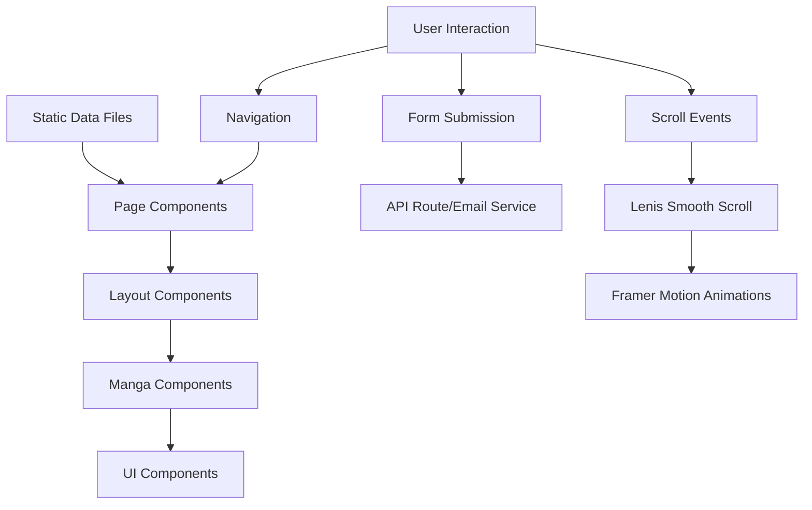

# Design Document: Manga Portfolio Website

## Overview

The manga-inspired portfolio website is a Next.js 14+ application that showcases personal work through an immersive monochrome manga aesthetic. The application leverages modern web technologies to create a unique, engaging user experience that combines traditional manga visual elements with smooth animations and responsive design.

### Core Technologies

- **Next.js 14+ (App Router)**: Server-side rendering, routing, and modern React features
- **Tailwind CSS**: Utility-first styling with custom monochrome theme configuration
- **Framer Motion**: Declarative animations for page transitions, scroll effects, and interactions
- **Lenis**: Smooth scrolling library for natural scroll behavior
- **shadcn/ui**: Accessible component primitives for forms and UI elements
- **TypeScript**: Type safety and enhanced developer experience

### Design Philosophy

The design embraces manga storytelling conventions:
- **Panel-based layouts**: Content organized in rectangular panels mimicking manga pages
- **Sequential revelation**: Content animates into view panel-by-panel as users scroll
- **Monochrome palette**: Strict black, white, and grayscale color scheme
- **Manga typography**: Bold impactful headers with clean body text
- **Visual effects**: Halftone patterns, speed lines, ink effects, and speech bubbles

## Architecture

### Application Structure

```
manga-portfolio-website/
├── app/
│   ├── layout.tsx                 # Root layout with providers
│   ├── page.tsx                   # Dashboard page (/)
│   ├── about/
│   │   └── page.tsx              # About page (/about)
│   ├── projects/
│   │   ├── page.tsx              # Projects listing (/projects)
│   │   └── [slug]/
│   │       └── page.tsx          # Project detail (/projects/[slug])
│   └── contact/
│       └── page.tsx              # Contact page (/contact)
├── components/
│   ├── layout/
│   │   ├── Navigation.tsx        # Fixed navigation bar
│   │   ├── Footer.tsx            # Site footer
│   │   └── PageTransition.tsx    # Page transition wrapper
│   ├── manga/
│   │   ├── MangaPanel.tsx        # Reusable panel container
│   │   ├── SpeechBubble.tsx      # Speech bubble component
│   │   ├── ChapterHeader.tsx     # Section divider
│   │   ├── HalftonePattern.tsx   # SVG halftone effect
│   │   └── InkEffect.tsx         # Ink brush stroke effects
│   ├── dashboard/
│   │   ├── HeroSection.tsx       # Hero with CTA buttons
│   │   └── FeaturedProjects.tsx  # Featured work preview
│   ├── about/
│   │   ├── IntroPanel.tsx        # Bio and photo
│   │   ├── SkillsPanel.tsx       # Skills with stat bars
│   │   ├── Timeline.tsx          # Career timeline
│   │   └── InterestsPanel.tsx    # Hobbies and favorites
│   ├── projects/
│   │   ├── ProjectCard.tsx       # Grid item with hover effect
│   │   ├── ProjectGrid.tsx       # Responsive grid container
│   │   ├── FilterTabs.tsx        # Category filters
│   │   └── ProjectDetail.tsx     # Full project view
│   ├── contact/
│   │   ├── ContactForm.tsx       # Form with validation
│   │   ├── ContactIntro.tsx      # Availability info
│   │   └── SocialLinks.tsx       # Social media badges
│   └── ui/
│       └── ...                   # shadcn/ui components
├── lib/
│   ├── data/
│   │   ├── projects.ts           # Project data
│   │   ├── skills.ts             # Skills data
│   │   ├── timeline.ts           # Timeline data
│   │   └── interests.ts          # Interests data
│   ├── animations/
│   │   ├── variants.ts           # Framer Motion variants
│   │   └── scroll-animations.ts  # Scroll-triggered animations
│   ├── utils/
│   │   ├── cn.ts                 # Class name utility
│   │   └── validation.ts         # Form validation
│   └── hooks/
│       ├── useSmoothScroll.ts    # Lenis integration
│       └── useScrollAnimation.ts # Scroll animation hook
├── styles/
│   └── globals.css               # Global styles and Tailwind config
├── public/
│   ├── images/                   # Static images
│   └── fonts/                    # Custom fonts
└── types/
    └── index.ts                  # TypeScript type definitions
```

### Routing Architecture

The application uses Next.js App Router with file-based routing:

- `/` - Dashboard page (hero + featured projects)
- `/about` - About page (bio, skills, timeline, interests)
- `/projects` - Projects listing with filtering
- `/projects/[slug]` - Individual project detail pages
- `/contact` - Contact form and social links

All routes are statically generated where possible, with dynamic routes for project details using `generateStaticParams`.

### State Management

The application uses minimal client-side state:

- **URL state**: Filter selections and navigation managed through URL parameters
- **Form state**: Contact form managed with React Hook Form
- **Animation state**: Managed by Framer Motion's built-in state
- **Scroll state**: Managed by Lenis smooth scroll library

No global state management library is required due to the static nature of portfolio content.

### Data Flow



## Components and Interfaces

### Core Layout Components

#### Navigation Component

```typescript
interface NavigationProps {
  currentPath: string;
}

// Features:
// - Fixed positioning at top
// - Links to all four main pages
// - Active state indication
// - Mobile hamburger menu (< 640px)
// - Manga chapter tab styling
// - Smooth scroll to top on logo click
```

#### PageTransition Component

```typescript
interface PageTransitionProps {
  children: React.ReactNode;
}

// Features:
// - Wraps page content
// - Manga page-turn animation
// - Slide/fade transition effects
// - Framer Motion AnimatePresence
```

### Manga Visual Components

#### MangaPanel Component

```typescript
interface MangaPanelProps {
  children: React.ReactNode;
  variant?: 'default' | 'bordered' | 'shadowed';
  animation?: 'fade' | 'slide' | 'reveal';
  className?: string;
}

// Features:
// - Rectangular container with manga styling
// - Border variations (solid, dashed, thick)
// - Optional shadow effects
// - Scroll-triggered reveal animation
// - Responsive sizing
```

#### SpeechBubble Component

```typescript
interface SpeechBubbleProps {
  children: React.ReactNode;
  variant?: 'speech' | 'thought' | 'shout';
  position?: 'left' | 'right' | 'center';
  tailDirection?: 'bottom-left' | 'bottom-right' | 'top-left' | 'top-right';
}

// Features:
// - SVG-based bubble shape
// - Multiple style variants
// - Configurable tail position
// - Responsive text sizing
```

#### HalftonePattern Component

```typescript
interface HalftonePatternProps {
  intensity?: 'light' | 'medium' | 'heavy';
  dotSize?: number;
  className?: string;
}

// Features:
// - SVG pattern definition
// - Configurable dot density
// - Overlay or background usage
// - Grayscale variations
```

#### ChapterHeader Component

```typescript
interface ChapterHeaderProps {
  title: string;
  subtitle?: string;
  chapterNumber?: number;
}

// Features:
// - Manga chapter title styling
// - Optional chapter numbering
// - Ink brush stroke divider
// - Bold typography
```

### Dashboard Components

#### HeroSection Component

```typescript
interface HeroSectionProps {
  headline: string;
  subheadline: string;
  avatarSrc: string;
  onViewProjects: () => void;
  onContact: () => void;
}

// Features:
// - Large manga-style typography
// - Animated character illustration
// - Two CTA buttons with ink splash hover
// - Responsive layout (stacked on mobile)
// - Entry animation on page load
```

#### FeaturedProjects Component

```typescript
interface FeaturedProject {
  id: string;
  title: string;
  description: string;
  thumbnail: string;
  tags: string[];
  slug: string;
}

interface FeaturedProjectsProps {
  projects: FeaturedProject[];
}

// Features:
// - "New Chapter" section divider
// - 2-3 project cards in manga panels
// - Hover reveal animations
// - Click navigation to project detail
// - Responsive grid (1 col mobile, 2-3 cols desktop)
```

### About Page Components

#### IntroPanel Component

```typescript
interface IntroPanelProps {
  name: string;
  bio: string;
  avatarSrc: string;
  inspirations: string[];
}

// Features:
// - Photo/avatar in manga style frame
// - Bio text in clean typography
// - Inspirations list with manga references
// - Panel reveal animation
```

#### SkillsPanel Component

```typescript
interface Skill {
  name: string;
  level: number; // 0-100
  category: 'frontend' | 'backend' | 'design' | 'other';
}

interface SkillsPanelProps {
  skills: Skill[];
  tools: string[];
}

// Features:
// - RPG-style stat bars for each skill
// - Animated fill on scroll into view
// - Grouped by category
// - Tools displayed as badges
// - Manga power level aesthetic
```

#### Timeline Component

```typescript
interface TimelineEvent {
  id: string;
  date: string;
  title: string;
  description: string;
  type: 'education' | 'work' | 'project' | 'achievement';
  isPast: boolean;
}

interface TimelineProps {
  events: TimelineEvent[];
}

// Features:
// - Vertical timeline in manga panel strip format
// - Events displayed chronologically
// - "Flashback" visual treatment for past events
// - Connecting lines between events
// - Responsive layout (simplified on mobile)
```

#### InterestsPanel Component

```typescript
interface Interest {
  title: string;
  type: 'manga' | 'anime' | 'hobby';
  image?: string;
  description?: string;
}

interface InterestsPanelProps {
  interests: Interest[];
}

// Features:
// - Trading card-style elements
// - Grid layout for manga/anime favorites
// - Hobbies displayed with icons
// - Hover flip animation
```

### Projects Page Components

#### ProjectGrid Component

```typescript
interface ProjectGridProps {
  projects: Project[];
  activeFilter: string;
}

// Features:
// - Responsive grid (1 col mobile, 2 col tablet, 3+ col desktop)
// - Manga panel-style layout
// - Sequential reveal animation on load
// - Empty state handling
```

#### ProjectCard Component

```typescript
interface Project {
  id: string;
  title: string;
  description: string;
  thumbnail: string;
  techStack: string[];
  category: 'web' | 'mobile' | 'uiux' | 'other';
  slug: string;
}

interface ProjectCardProps {
  project: Project;
  index: number;
}

// Features:
// - Manga panel container
// - Thumbnail image with halftone overlay
// - Title and short description
// - Tech stack badges
// - Hover panel flip animation revealing details
// - Click navigation to detail page
// - Staggered entrance animation
```

#### FilterTabs Component

```typescript
interface FilterTabsProps {
  activeFilter: string;
  onFilterChange: (filter: string) => void;
}

// Features:
// - Tabs for: All, Web Apps, Mobile Apps, UI/UX, Other
// - Manga chapter tab styling
// - Active state indication
// - Smooth transition between filters
// - Responsive (scrollable on mobile)
```

#### ProjectDetail Component

```typescript
interface ProjectDetailProps {
  project: ProjectDetailData;
}

interface ProjectDetailData extends Project {
  fullDescription: string;
  screenshots: string[];
  demoUrl?: string;
  repoUrl?: string;
  challenges: string[];
  learnings: string[];
  impact: {
    metric: string;
    value: string;
  }[];
}

// Features:
// - Full project information
// - Screenshots in comic panel layout
// - Demo and repo links with button styling
// - Challenges, learnings, and impact as "power stats"
// - Back navigation to projects page
// - Scroll-triggered panel animations
```

### Contact Page Components

#### ContactIntro Component

```typescript
interface ContactIntroProps {
  availability: string;
  preferredMethods: string[];
}

// Features:
// - Speech bubble with availability info
// - Preferred contact method icons
// - Manga character illustration
```

#### ContactForm Component

```typescript
interface ContactFormProps {
  onSubmit: (data: ContactFormData) => Promise<void>;
}

interface ContactFormData {
  name: string;
  email: string;
  subject: string;
  message: string;
}

// Features:
// - Form fields styled as manga dialogue boxes
// - Client-side validation
// - Submit button as "Action" manga panel
// - Loading state during submission
// - Success/error feedback with manga reactions
// - Accessible form labels and error messages
```

#### SocialLinks Component

```typescript
interface SocialLink {
  platform: 'github' | 'linkedin' | 'twitter' | 'email';
  url: string;
  username: string;
}

interface SocialLinksProps {
  links: SocialLink[];
  email?: string;
  location?: string;
}

// Features:
// - Email in typewriter-style text
// - Social icons as manga badge style
// - Open links in new tab
// - Location with map marker icon
// - Hover ink splash effects
```

## Data Models

### Project Model

```typescript
interface Project {
  id: string;
  slug: string;
  title: string;
  description: string;
  fullDescription: string;
  thumbnail: string;
  screenshots: string[];
  techStack: string[];
  category: 'web' | 'mobile' | 'uiux' | 'other';
  featured: boolean;
  demoUrl?: string;
  repoUrl?: string;
  challenges: string[];
  learnings: string[];
  impact: ProjectImpact[];
  createdAt: string;
}

interface ProjectImpact {
  metric: string;
  value: string;
}
```

### Skill Model

```typescript
interface Skill {
  id: string;
  name: string;
  level: number; // 0-100
  category: 'frontend' | 'backend' | 'design' | 'tools' | 'other';
  icon?: string;
}

interface Tool {
  name: string;
  category: string;
}
```

### Timeline Model

```typescript
interface TimelineEvent {
  id: string;
  date: string; // ISO date string
  title: string;
  description: string;
  type: 'education' | 'work' | 'project' | 'achievement';
  organization?: string;
  location?: string;
  isPast: boolean;
}
```

### Interest Model

```typescript
interface Interest {
  id: string;
  title: string;
  type: 'manga' | 'anime' | 'hobby';
  image?: string;
  description?: string;
  rating?: number;
}
```

### Contact Form Model

```typescript
interface ContactFormData {
  name: string;
  email: string;
  subject: string;
  message: string;
}

interface ContactFormValidation {
  name: {
    required: true;
    minLength: 2;
    maxLength: 100;
  };
  email: {
    required: true;
    pattern: /^[^\s@]+@[^\s@]+\.[^\s@]+$/;
  };
  subject: {
    required: true;
    minLength: 5;
    maxLength: 200;
  };
  message: {
    required: true;
    minLength: 10;
    maxLength: 2000;
  };
}
```

### Navigation Model

```typescript
interface NavLink {
  label: string;
  href: string;
  icon?: string;
}

const navigationLinks: NavLink[] = [
  { label: 'Home', href: '/' },
  { label: 'About', href: '/about' },
  { label: 'Projects', href: '/projects' },
  { label: 'Contact', href: '/contact' }
];
```

### Theme Configuration

```typescript
interface MonochromePalette {
  black: '#000000';
  white: '#FFFFFF';
  gray: {
    900: '#1A1A1A';
    800: '#333333';
    600: '#666666';
    400: '#999999';
    200: '#E5E5E5';
    50: '#F5F5F5';
  };
}

interface MangaTheme {
  colors: MonochromePalette;
  fonts: {
    heading: string; // Bold impactful font
    body: string;    // Clean sans-serif
    mono: string;    // Monospace for code
  };
  spacing: {
    panelGap: string;
    sectionPadding: string;
  };
  breakpoints: {
    mobile: '640px';
    tablet: '1024px';
  };
}
```


## Correctness Properties

A property is a characteristic or behavior that should hold true across all valid executions of a system—essentially, a formal statement about what the system should do. Properties serve as the bridge between human-readable specifications and machine-verifiable correctness guarantees.

### Property Reflection

After analyzing all 75 acceptance criteria, I identified the following redundancies:

- **Navigation properties (1.4, 4.4, 9.4)**: All test that clicking elements navigates correctly. These can be combined into a single property about navigation behavior.
- **Hover effect properties (9.3, 22.1, 22.2, 22.3)**: All test hover interactions. These can be combined into a single property about hover feedback.
- **Project card content properties (9.2, 12.1)**: Both test that project information is displayed correctly. These can be combined.
- **Form validation properties (13.4, 13.5)**: Both test form validation behavior and can be combined into a comprehensive validation property.
- **Social link behavior (15.3)**: This is a specific instance of general link behavior and can be tested as an example rather than a property.

The following properties provide unique validation value and will be included:

### Property 1: Navigation Fixed Positioning

*For any* scroll position on any page, the navigation bar should remain fixed at the top of the viewport.

**Validates: Requirements 1.3**

### Property 2: Monochrome Color Compliance

*For any* rendered element in the application, all computed color values (text, background, border) should be from the approved monochrome palette: #000000, #FFFFFF, #1A1A1A, #333333, #666666, #999999, #E5E5E5, or #F5F5F5.

**Validates: Requirements 2.1**

### Property 3: Clickable Element Navigation

*For any* clickable element with a navigation target (navigation links, project cards, CTA buttons), clicking the element should navigate to the correct destination route.

**Validates: Requirements 1.4, 4.4, 9.4**

### Property 4: Project Card Content Completeness

*For any* project in the system, its rendered card should contain all required fields: thumbnail, title, description, and tech stack.

**Validates: Requirements 9.2**

### Property 5: Project Filtering

*For any* category filter selection, the displayed projects should include only projects matching that category, and all projects in that category should be displayed.

**Validates: Requirements 10.3**

### Property 6: Project Detail Completeness

*For any* project in the system, its detail view should contain all required information: full description, screenshots, demo link (if available), repository link (if available), challenges, learnings, and impact metrics.

**Validates: Requirements 12.1**

### Property 7: Form Validation

*For any* contact form submission, if the data is invalid (missing required fields, invalid email format, or field length violations), the form should display appropriate validation errors and prevent submission. If the data is valid, the form should submit successfully.

**Validates: Requirements 13.4, 13.5**

### Property 8: Interactive Hover Feedback

*For any* interactive element (buttons, project cards, navigation links), hovering over the element should trigger a visual change (animation, color change, or effect).

**Validates: Requirements 9.3, 22.1, 22.2, 22.3**

### Property 9: Scroll-Triggered Panel Animation

*For any* manga panel component, when it enters the viewport during scrolling, it should trigger a reveal animation.

**Validates: Requirements 23.1**

### Property 10: Page Transition Animation

*For any* navigation between pages, the transition should include an animation effect (slide or fade).

**Validates: Requirements 24.1**

### Property 11: Smooth Scrolling Active

*For any* page in the application, scrolling should use smooth scroll behavior rather than instant jumps.

**Validates: Requirements 25.2**

## Error Handling

### Form Validation Errors

The contact form implements comprehensive client-side validation:

- **Required field validation**: All fields (name, email, subject, message) must be non-empty
- **Email format validation**: Email must match standard email pattern
- **Length validation**: 
  - Name: 2-100 characters
  - Subject: 5-200 characters
  - Message: 10-2000 characters
- **Error display**: Validation errors appear below each field with manga-style error indicators
- **Submission prevention**: Form cannot be submitted while validation errors exist

### Form Submission Errors

When form submission fails (network error, server error):

- Display error message with frustrated manga character reaction
- Preserve form data so user doesn't lose their input
- Provide retry option
- Log error details for debugging

### Navigation Errors

For invalid routes or missing project slugs:

- Implement Next.js 404 page with manga-style "Lost in the Panels" illustration
- Provide navigation back to home page
- Suggest alternative pages (Projects, About, Contact)

### Image Loading Errors

For missing or failed image loads:

- Use Next.js Image component with placeholder
- Provide fallback manga-style placeholder illustration
- Implement lazy loading for performance
- Handle loading states with skeleton screens

### Empty States

- **No projects**: Display "Coming Soon" manga illustration with encouraging message
- **No filtered results**: Display "No projects found" with suggestion to try different filter
- **No timeline events**: Display placeholder message
- **No interests**: Display placeholder message

### Responsive Breakpoint Handling

- Gracefully handle viewport size changes
- Prevent layout shift during resize
- Maintain scroll position during orientation change
- Test all breakpoints: <640px (mobile), 640-1024px (tablet), >1024px (desktop)

## Testing Strategy

### Dual Testing Approach

The application requires both unit testing and property-based testing for comprehensive coverage:

- **Unit tests**: Verify specific examples, edge cases, and error conditions
- **Property tests**: Verify universal properties across all inputs

Together, these approaches provide comprehensive coverage where unit tests catch concrete bugs and property tests verify general correctness.

### Unit Testing

**Framework**: Jest + React Testing Library

**Focus Areas**:

1. **Component rendering**: Verify specific components render with expected content
   - Hero section displays correct headline and buttons
   - Navigation contains all four required links
   - Contact form displays all required fields
   - About page sections (intro, skills, timeline, interests) render correctly

2. **User interactions**: Test specific interaction examples
   - Clicking "View Projects" button navigates to /projects
   - Clicking "Contact Me" button navigates to /contact
   - Submitting contact form with valid data
   - Clicking filter tabs changes displayed projects

3. **Edge cases**:
   - Empty projects list displays "Coming Soon" message
   - Filtered results with zero matches display appropriate message
   - Form submission with empty fields shows validation errors
   - Form submission with invalid email shows email error

4. **Responsive behavior**: Test specific breakpoints
   - Mobile (<640px): Single column layout, stacked panels, mobile navigation
   - Tablet (640-1024px): 2-column grid layout
   - Desktop (>1024px): Multi-column layout

5. **Error states**:
   - Form submission failure displays error message
   - Form submission success displays success message
   - Missing images show fallback placeholders

**Example Unit Tests**:

```typescript
describe('Dashboard Hero Section', () => {
  it('displays headline, subheadline, and CTA buttons', () => {
    render(<HeroSection />);
    expect(screen.getByRole('heading', { level: 1 })).toBeInTheDocument();
    expect(screen.getByText(/view projects/i)).toBeInTheDocument();
    expect(screen.getByText(/contact me/i)).toBeInTheDocument();
  });
});

describe('Contact Form Validation', () => {
  it('shows error when email is invalid', async () => {
    render(<ContactForm />);
    await userEvent.type(screen.getByLabelText(/email/i), 'invalid-email');
    await userEvent.click(screen.getByRole('button', { name: /submit/i }));
    expect(screen.getByText(/valid email/i)).toBeInTheDocument();
  });
});
```

### Property-Based Testing

**Framework**: fast-check (JavaScript property-based testing library)

**Configuration**: Minimum 100 iterations per property test

**Tag Format**: Each test must include a comment referencing the design property:
```typescript
// Feature: manga-portfolio-website, Property 1: Navigation Fixed Positioning
```

**Focus Areas**:

1. **Navigation behavior**: Test across all scroll positions and pages
2. **Color compliance**: Test all rendered elements for color palette adherence
3. **Clickable elements**: Test all navigation targets
4. **Project data**: Test with randomly generated project data
5. **Form validation**: Test with randomly generated valid and invalid inputs
6. **Hover interactions**: Test all interactive elements
7. **Scroll animations**: Test panels at various scroll positions
8. **Page transitions**: Test all page navigation combinations

**Property Test Implementation**:

```typescript
// Feature: manga-portfolio-website, Property 2: Monochrome Color Compliance
describe('Monochrome Color Compliance', () => {
  it('all elements use only approved monochrome colors', () => {
    fc.assert(
      fc.property(
        fc.constantFrom('/', '/about', '/projects', '/contact'),
        (route) => {
          render(<App initialRoute={route} />);
          const allElements = screen.getAllByRole(/.*/);
          const approvedColors = [
            '#000000', '#ffffff', '#1a1a1a', '#333333',
            '#666666', '#999999', '#e5e5e5', '#f5f5f5'
          ];
          
          allElements.forEach(element => {
            const styles = window.getComputedStyle(element);
            const colors = [
              styles.color,
              styles.backgroundColor,
              styles.borderColor
            ];
            
            colors.forEach(color => {
              if (color && color !== 'transparent') {
                expect(approvedColors).toContain(
                  rgbToHex(color).toLowerCase()
                );
              }
            });
          });
        }
      ),
      { numRuns: 100 }
    );
  });
});

// Feature: manga-portfolio-website, Property 4: Project Card Content Completeness
describe('Project Card Content Completeness', () => {
  it('all project cards contain required fields', () => {
    fc.assert(
      fc.property(
        fc.array(projectArbitrary, { minLength: 1, maxLength: 20 }),
        (projects) => {
          render(<ProjectGrid projects={projects} />);
          
          projects.forEach(project => {
            const card = screen.getByTestId(`project-card-${project.id}`);
            expect(within(card).getByAltText(project.title)).toBeInTheDocument();
            expect(within(card).getByText(project.title)).toBeInTheDocument();
            expect(within(card).getByText(project.description)).toBeInTheDocument();
            project.techStack.forEach(tech => {
              expect(within(card).getByText(tech)).toBeInTheDocument();
            });
          });
        }
      ),
      { numRuns: 100 }
    );
  });
});

// Feature: manga-portfolio-website, Property 7: Form Validation
describe('Form Validation', () => {
  it('validates form data correctly for all inputs', () => {
    fc.assert(
      fc.property(
        contactFormArbitrary,
        (formData) => {
          render(<ContactForm />);
          
          // Fill form
          userEvent.type(screen.getByLabelText(/name/i), formData.name);
          userEvent.type(screen.getByLabelText(/email/i), formData.email);
          userEvent.type(screen.getByLabelText(/subject/i), formData.subject);
          userEvent.type(screen.getByLabelText(/message/i), formData.message);
          
          // Submit
          userEvent.click(screen.getByRole('button', { name: /submit/i }));
          
          // Check validation
          const isValid = validateContactForm(formData);
          if (isValid) {
            expect(screen.queryByText(/error/i)).not.toBeInTheDocument();
          } else {
            expect(screen.getByText(/error/i)).toBeInTheDocument();
          }
        }
      ),
      { numRuns: 100 }
    );
  });
});
```

**Arbitrary Generators**:

```typescript
const projectArbitrary = fc.record({
  id: fc.uuid(),
  slug: fc.stringOf(fc.constantFrom('a-z', '0-9', '-'), { minLength: 5, maxLength: 30 }),
  title: fc.string({ minLength: 5, maxLength: 100 }),
  description: fc.string({ minLength: 20, maxLength: 500 }),
  thumbnail: fc.webUrl(),
  techStack: fc.array(fc.string({ minLength: 2, maxLength: 20 }), { minLength: 1, maxLength: 10 }),
  category: fc.constantFrom('web', 'mobile', 'uiux', 'other'),
  featured: fc.boolean()
});

const contactFormArbitrary = fc.record({
  name: fc.string({ minLength: 0, maxLength: 150 }),
  email: fc.oneof(
    fc.emailAddress(),
    fc.string({ minLength: 0, maxLength: 100 })
  ),
  subject: fc.string({ minLength: 0, maxLength: 250 }),
  message: fc.string({ minLength: 0, maxLength: 2500 })
});
```

### Integration Testing

**Framework**: Playwright or Cypress

**Focus Areas**:

1. **End-to-end user flows**:
   - Landing on homepage → viewing projects → clicking project → viewing detail
   - Landing on homepage → navigating to contact → filling form → submitting
   - Landing on homepage → navigating to about → scrolling through sections

2. **Animation behavior**:
   - Scroll-triggered panel animations
   - Page transition animations
   - Hover effects

3. **Responsive behavior**:
   - Test at multiple viewport sizes
   - Test orientation changes
   - Test touch interactions on mobile

### Performance Testing

**Tools**: Lighthouse, Web Vitals

**Metrics**:
- First Contentful Paint (FCP) < 1.5s
- Largest Contentful Paint (LCP) < 2.5s
- Cumulative Layout Shift (CLS) < 0.1
- First Input Delay (FID) < 100ms
- Time to Interactive (TTI) < 3.5s

**Focus Areas**:
- Image optimization with Next.js Image component
- Code splitting and lazy loading
- Animation performance (60fps target)
- Smooth scroll performance with Lenis
- Bundle size optimization

### Accessibility Testing

**Tools**: axe-core, WAVE, manual testing with screen readers

**Focus Areas**:
- Semantic HTML structure
- ARIA labels for interactive elements
- Keyboard navigation support
- Focus management
- Color contrast ratios (monochrome palette should provide sufficient contrast)
- Screen reader compatibility

### Visual Regression Testing

**Tools**: Percy or Chromatic

**Focus Areas**:
- Component visual consistency
- Responsive layout at all breakpoints
- Animation states
- Hover states
- Error states
- Empty states


## Styling Implementation

### Tailwind CSS Configuration

**tailwind.config.ts**:

```typescript
import type { Config } from 'tailwindcss';

const config: Config = {
  content: [
    './pages/**/*.{js,ts,jsx,tsx,mdx}',
    './components/**/*.{js,ts,jsx,tsx,mdx}',
    './app/**/*.{js,ts,jsx,tsx,mdx}',
  ],
  theme: {
    extend: {
      colors: {
        manga: {
          black: '#000000',
          white: '#FFFFFF',
          gray: {
            900: '#1A1A1A',
            800: '#333333',
            600: '#666666',
            400: '#999999',
            200: '#E5E5E5',
            50: '#F5F5F5',
          },
        },
      },
      fontFamily: {
        heading: ['var(--font-heading)', 'Impact', 'sans-serif'],
        body: ['var(--font-body)', 'Inter', 'system-ui', 'sans-serif'],
        mono: ['var(--font-mono)', 'Courier New', 'monospace'],
      },
      spacing: {
        'panel-gap': '1.5rem',
        'section': '4rem',
      },
      borderWidth: {
        'manga': '3px',
        'manga-thick': '5px',
      },
      boxShadow: {
        'manga': '4px 4px 0px 0px rgba(0, 0, 0, 1)',
        'manga-hover': '6px 6px 0px 0px rgba(0, 0, 0, 1)',
      },
      animation: {
        'panel-reveal': 'panelReveal 0.6s ease-out',
        'ink-splash': 'inkSplash 0.4s ease-out',
        'speed-line': 'speedLine 0.3s ease-out',
      },
      keyframes: {
        panelReveal: {
          '0%': { opacity: '0', transform: 'translateY(20px)' },
          '100%': { opacity: '1', transform: 'translateY(0)' },
        },
        inkSplash: {
          '0%': { transform: 'scale(0.8)', opacity: '0' },
          '50%': { transform: 'scale(1.1)', opacity: '1' },
          '100%': { transform: 'scale(1)', opacity: '1' },
        },
        speedLine: {
          '0%': { transform: 'scaleX(0)', opacity: '0' },
          '100%': { transform: 'scaleX(1)', opacity: '1' },
        },
      },
    },
  },
  plugins: [],
};

export default config;
```

### Global Styles

**styles/globals.css**:

```css
@tailwind base;
@tailwind components;
@tailwind utilities;

@layer base {
  :root {
    --font-heading: 'Bebas Neue', Impact, sans-serif;
    --font-body: 'Inter', system-ui, sans-serif;
    --font-mono: 'Courier New', monospace;
  }
  
  * {
    @apply border-manga-black;
  }
  
  body {
    @apply bg-manga-white text-manga-black font-body;
  }
  
  h1, h2, h3, h4, h5, h6 {
    @apply font-heading uppercase tracking-wider;
  }
}

@layer components {
  /* Manga Panel Base */
  .manga-panel {
    @apply border-manga border-manga-black bg-manga-white p-6 relative;
  }
  
  .manga-panel-bordered {
    @apply manga-panel shadow-manga;
  }
  
  /* Speech Bubble */
  .speech-bubble {
    @apply relative bg-manga-white border-manga border-manga-black rounded-2xl p-4;
  }
  
  .speech-bubble::after {
    content: '';
    @apply absolute w-0 h-0 border-solid;
    border-width: 15px 15px 0 0;
    border-color: #000 transparent transparent transparent;
  }
  
  /* Halftone Pattern */
  .halftone-overlay {
    @apply absolute inset-0 opacity-30 pointer-events-none;
    background-image: radial-gradient(circle, #000 1px, transparent 1px);
    background-size: 4px 4px;
  }
  
  /* Manga Button */
  .manga-button {
    @apply px-6 py-3 border-manga border-manga-black bg-manga-black text-manga-white 
           font-heading uppercase tracking-wider shadow-manga 
           hover:shadow-manga-hover hover:translate-x-[-2px] hover:translate-y-[-2px]
           transition-all duration-200 cursor-pointer;
  }
  
  .manga-button-outline {
    @apply manga-button bg-manga-white text-manga-black;
  }
  
  /* Form Fields */
  .manga-input {
    @apply w-full px-4 py-3 border-manga border-manga-black bg-manga-gray-50
           focus:outline-none focus:ring-2 focus:ring-manga-black focus:border-manga-black
           font-body text-manga-black placeholder:text-manga-gray-400;
  }
  
  .manga-textarea {
    @apply manga-input min-h-[150px] resize-y;
  }
  
  /* Chapter Header */
  .chapter-header {
    @apply relative text-4xl md:text-5xl font-heading uppercase text-center py-8;
  }
  
  .chapter-header::before,
  .chapter-header::after {
    content: '';
    @apply absolute top-1/2 w-1/4 h-1 bg-manga-black;
  }
  
  .chapter-header::before {
    @apply left-0;
  }
  
  .chapter-header::after {
    @apply right-0;
  }
  
  /* Stat Bar (Skills) */
  .stat-bar {
    @apply relative w-full h-8 border-manga border-manga-black bg-manga-gray-50 overflow-hidden;
  }
  
  .stat-bar-fill {
    @apply absolute inset-y-0 left-0 bg-manga-black transition-all duration-1000 ease-out;
  }
  
  /* Trading Card */
  .trading-card {
    @apply relative border-manga border-manga-black bg-manga-white p-4 
           shadow-manga hover:shadow-manga-hover hover:translate-x-[-2px] hover:translate-y-[-2px]
           transition-all duration-200 cursor-pointer;
  }
  
  /* Speed Lines */
  .speed-lines {
    @apply absolute inset-0 pointer-events-none overflow-hidden;
  }
  
  .speed-lines::before {
    content: '';
    @apply absolute inset-0 bg-gradient-to-r from-transparent via-manga-black to-transparent opacity-20;
    transform: skewX(-20deg);
  }
}

@layer utilities {
  .text-outline {
    text-shadow: 
      -2px -2px 0 #000,
      2px -2px 0 #000,
      -2px 2px 0 #000,
      2px 2px 0 #000;
  }
  
  .ink-brush-stroke {
    background-image: url('/images/ink-brush.svg');
    background-repeat: no-repeat;
    background-size: contain;
  }
}
```

### Component-Specific Styles

Each component uses Tailwind utility classes combined with custom manga-themed classes. The styling approach prioritizes:

1. **Consistency**: All components use the monochrome palette
2. **Reusability**: Common patterns extracted into utility classes
3. **Responsiveness**: Mobile-first approach with breakpoint modifiers
4. **Performance**: Minimal custom CSS, leveraging Tailwind's optimization

## Animation Implementation

### Framer Motion Configuration

**lib/animations/variants.ts**:

```typescript
import { Variants } from 'framer-motion';

// Page transition variants
export const pageVariants: Variants = {
  initial: {
    opacity: 0,
    x: -20,
  },
  animate: {
    opacity: 1,
    x: 0,
    transition: {
      duration: 0.4,
      ease: 'easeOut',
    },
  },
  exit: {
    opacity: 0,
    x: 20,
    transition: {
      duration: 0.3,
      ease: 'easeIn',
    },
  },
};

// Manga panel reveal variants
export const panelVariants: Variants = {
  hidden: {
    opacity: 0,
    y: 30,
    scale: 0.95,
  },
  visible: {
    opacity: 1,
    y: 0,
    scale: 1,
    transition: {
      duration: 0.6,
      ease: [0.25, 0.46, 0.45, 0.94],
    },
  },
};

// Staggered children animation
export const containerVariants: Variants = {
  hidden: { opacity: 0 },
  visible: {
    opacity: 1,
    transition: {
      staggerChildren: 0.15,
      delayChildren: 0.1,
    },
  },
};

// Hover animation for cards
export const cardHoverVariants: Variants = {
  rest: {
    scale: 1,
    rotateY: 0,
  },
  hover: {
    scale: 1.02,
    rotateY: 5,
    transition: {
      duration: 0.3,
      ease: 'easeOut',
    },
  },
};

// Ink splash effect
export const inkSplashVariants: Variants = {
  initial: {
    scale: 0,
    opacity: 0,
  },
  animate: {
    scale: [0, 1.2, 1],
    opacity: [0, 1, 1],
    transition: {
      duration: 0.5,
      times: [0, 0.6, 1],
      ease: 'easeOut',
    },
  },
};

// Speed lines animation
export const speedLinesVariants: Variants = {
  hidden: {
    scaleX: 0,
    opacity: 0,
  },
  visible: {
    scaleX: 1,
    opacity: 0.6,
    transition: {
      duration: 0.4,
      ease: 'easeOut',
    },
  },
};
```

### Scroll Animation Hook

**lib/hooks/useScrollAnimation.ts**:

```typescript
import { useInView } from 'framer-motion';
import { useRef } from 'react';

interface UseScrollAnimationOptions {
  threshold?: number;
  triggerOnce?: boolean;
  margin?: string;
}

export function useScrollAnimation(options: UseScrollAnimationOptions = {}) {
  const ref = useRef(null);
  const isInView = useInView(ref, {
    once: options.triggerOnce ?? true,
    amount: options.threshold ?? 0.3,
    margin: options.margin ?? '0px 0px -100px 0px',
  });

  return { ref, isInView };
}
```

### Lenis Smooth Scroll Integration

**lib/hooks/useSmoothScroll.ts**:

```typescript
'use client';

import { useEffect } from 'react';
import Lenis from '@studio-freight/lenis';

export function useSmoothScroll() {
  useEffect(() => {
    const lenis = new Lenis({
      duration: 1.2,
      easing: (t) => Math.min(1, 1.001 - Math.pow(2, -10 * t)),
      orientation: 'vertical',
      gestureOrientation: 'vertical',
      smoothWheel: true,
      wheelMultiplier: 1,
      smoothTouch: false,
      touchMultiplier: 2,
      infinite: false,
    });

    function raf(time: number) {
      lenis.raf(time);
      requestAnimationFrame(raf);
    }

    requestAnimationFrame(raf);

    return () => {
      lenis.destroy();
    };
  }, []);
}
```

**app/layout.tsx** (Lenis provider):

```typescript
'use client';

import { useSmoothScroll } from '@/lib/hooks/useSmoothScroll';

export default function RootLayout({
  children,
}: {
  children: React.ReactNode;
}) {
  useSmoothScroll();

  return (
    <html lang="en">
      <body>{children}</body>
    </html>
  );
}
```

### Animation Usage Examples

**MangaPanel Component**:

```typescript
'use client';

import { motion } from 'framer-motion';
import { useScrollAnimation } from '@/lib/hooks/useScrollAnimation';
import { panelVariants } from '@/lib/animations/variants';

export function MangaPanel({ children, className }: MangaPanelProps) {
  const { ref, isInView } = useScrollAnimation();

  return (
    <motion.div
      ref={ref}
      variants={panelVariants}
      initial="hidden"
      animate={isInView ? 'visible' : 'hidden'}
      className={`manga-panel ${className}`}
    >
      {children}
    </motion.div>
  );
}
```

**PageTransition Component**:

```typescript
'use client';

import { motion, AnimatePresence } from 'framer-motion';
import { usePathname } from 'next/navigation';
import { pageVariants } from '@/lib/animations/variants';

export function PageTransition({ children }: PageTransitionProps) {
  const pathname = usePathname();

  return (
    <AnimatePresence mode="wait">
      <motion.div
        key={pathname}
        variants={pageVariants}
        initial="initial"
        animate="animate"
        exit="exit"
      >
        {children}
      </motion.div>
    </AnimatePresence>
  );
}
```

## Responsive Design Strategy

### Breakpoint System

The application uses three primary breakpoints:

- **Mobile**: < 640px (single column, stacked layout)
- **Tablet**: 640px - 1024px (2-column grid)
- **Desktop**: > 1024px (multi-column manga panel layout)

### Mobile-First Approach

All components are designed mobile-first, with progressive enhancement for larger screens:

```typescript
// Example: Project Grid responsive classes
<div className="grid grid-cols-1 md:grid-cols-2 lg:grid-cols-3 gap-panel-gap">
  {projects.map(project => <ProjectCard key={project.id} project={project} />)}
</div>
```

### Responsive Component Behavior

**Navigation**:
- Mobile: Hamburger menu with slide-out drawer
- Tablet/Desktop: Horizontal navigation bar with all links visible

**Hero Section**:
- Mobile: Stacked layout (avatar → headline → buttons)
- Desktop: Side-by-side layout (avatar left, content right)

**Project Grid**:
- Mobile: 1 column
- Tablet: 2 columns
- Desktop: 3+ columns (depending on screen width)

**Timeline**:
- Mobile: Simplified vertical timeline with minimal details
- Desktop: Full timeline with all details and connecting lines

### Touch Interactions

For mobile devices:
- Hover effects replaced with tap interactions
- Swipe gestures for navigation (optional enhancement)
- Larger touch targets (minimum 44x44px)
- Prevent hover states from "sticking" on touch devices

```css
@media (hover: hover) and (pointer: fine) {
  .manga-button:hover {
    /* Hover styles only on devices with precise pointers */
  }
}
```

## Performance Optimization

### Image Optimization

- Use Next.js Image component for automatic optimization
- Implement lazy loading for below-the-fold images
- Provide appropriate image sizes for different breakpoints
- Use WebP format with fallbacks

```typescript
import Image from 'next/image';

<Image
  src={project.thumbnail}
  alt={project.title}
  width={600}
  height={400}
  loading="lazy"
  placeholder="blur"
  blurDataURL={project.thumbnailBlur}
/>
```

### Code Splitting

- Automatic code splitting via Next.js App Router
- Dynamic imports for heavy components
- Route-based splitting (each page is a separate bundle)

```typescript
import dynamic from 'next/dynamic';

const HeavyComponent = dynamic(() => import('./HeavyComponent'), {
  loading: () => <LoadingSpinner />,
  ssr: false,
});
```

### Animation Performance

- Use CSS transforms and opacity for animations (GPU-accelerated)
- Avoid animating layout properties (width, height, top, left)
- Use `will-change` sparingly for critical animations
- Implement `prefers-reduced-motion` support

```css
@media (prefers-reduced-motion: reduce) {
  * {
    animation-duration: 0.01ms !important;
    animation-iteration-count: 1 !important;
    transition-duration: 0.01ms !important;
  }
}
```

### Bundle Size Optimization

- Tree-shake unused Framer Motion features
- Import only necessary Lenis features
- Use Tailwind's purge feature to remove unused styles
- Analyze bundle with Next.js bundle analyzer

## Accessibility Considerations

### Semantic HTML

- Use appropriate heading hierarchy (h1 → h2 → h3)
- Use semantic elements (nav, main, section, article, footer)
- Provide meaningful alt text for all images
- Use button elements for clickable actions

### Keyboard Navigation

- All interactive elements accessible via keyboard
- Visible focus indicators
- Logical tab order
- Skip-to-content link for screen readers

### ARIA Labels

```typescript
<button
  aria-label="Navigate to projects page"
  onClick={handleNavigate}
>
  View Projects
</button>

<nav aria-label="Main navigation">
  {/* Navigation links */}
</nav>
```

### Color Contrast

The monochrome palette provides excellent contrast:
- Black text on white background: 21:1 ratio (AAA)
- White text on black background: 21:1 ratio (AAA)
- Gray variations tested for WCAG AA compliance

### Screen Reader Support

- Announce page transitions
- Provide context for animations
- Label form fields properly
- Announce form validation errors

## Deployment and Build Configuration

### Next.js Configuration

**next.config.js**:

```javascript
/** @type {import('next').NextConfig} */
const nextConfig = {
  images: {
    formats: ['image/webp'],
    deviceSizes: [640, 750, 828, 1080, 1200, 1920, 2048, 3840],
    imageSizes: [16, 32, 48, 64, 96, 128, 256, 384],
  },
  compiler: {
    removeConsole: process.env.NODE_ENV === 'production',
  },
  experimental: {
    optimizeCss: true,
  },
};

module.exports = nextConfig;
```

### Environment Variables

```env
# .env.local
NEXT_PUBLIC_SITE_URL=https://portfolio.example.com
NEXT_PUBLIC_CONTACT_EMAIL=contact@example.com
CONTACT_FORM_ENDPOINT=/api/contact
```

### Static Generation

All pages except contact form submission are statically generated:

```typescript
// app/projects/[slug]/page.tsx
export async function generateStaticParams() {
  const projects = await getProjects();
  return projects.map((project) => ({
    slug: project.slug,
  }));
}
```

### Build Commands

```json
{
  "scripts": {
    "dev": "next dev",
    "build": "next build",
    "start": "next start",
    "lint": "next lint",
    "test": "jest",
    "test:watch": "jest --watch",
    "test:coverage": "jest --coverage",
    "test:e2e": "playwright test",
    "type-check": "tsc --noEmit"
  }
}
```

## Summary

This design document provides a comprehensive technical blueprint for the manga-inspired portfolio website. The architecture leverages Next.js 14+ App Router for optimal performance, Tailwind CSS for consistent styling, Framer Motion for smooth animations, and Lenis for natural scrolling behavior.

Key design decisions:
- **Component-based architecture**: Reusable manga-themed components
- **Static generation**: Maximum performance through pre-rendering
- **Monochrome palette**: Strict adherence to black, white, and grayscale
- **Responsive design**: Mobile-first approach with three breakpoints
- **Animation strategy**: Scroll-triggered reveals and page transitions
- **Testing approach**: Dual strategy with unit tests and property-based tests
- **Accessibility**: Semantic HTML, keyboard navigation, and WCAG compliance

The implementation follows modern web development best practices while maintaining the unique manga aesthetic throughout the user experience.

