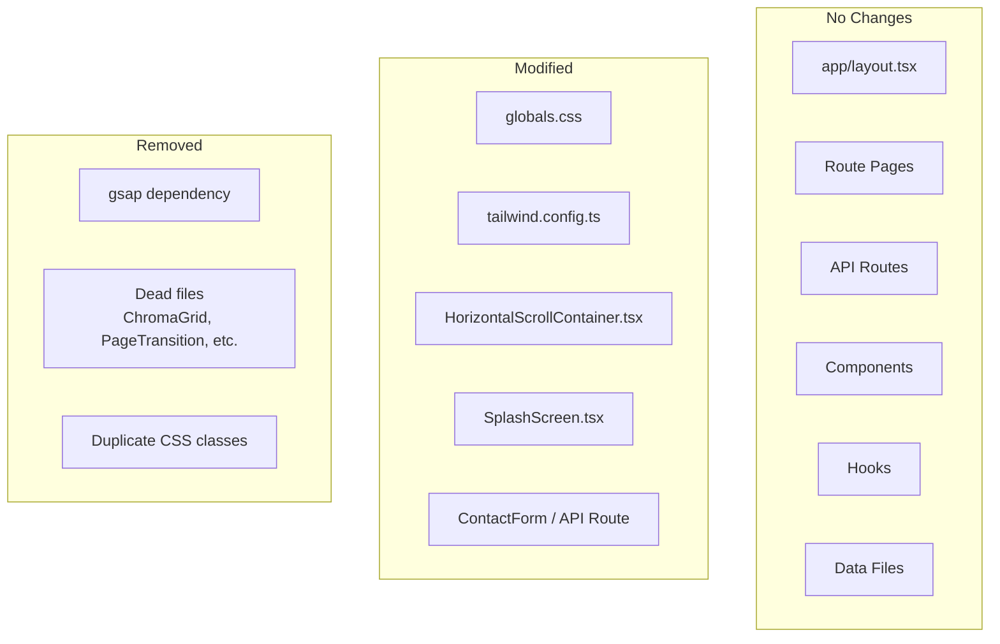
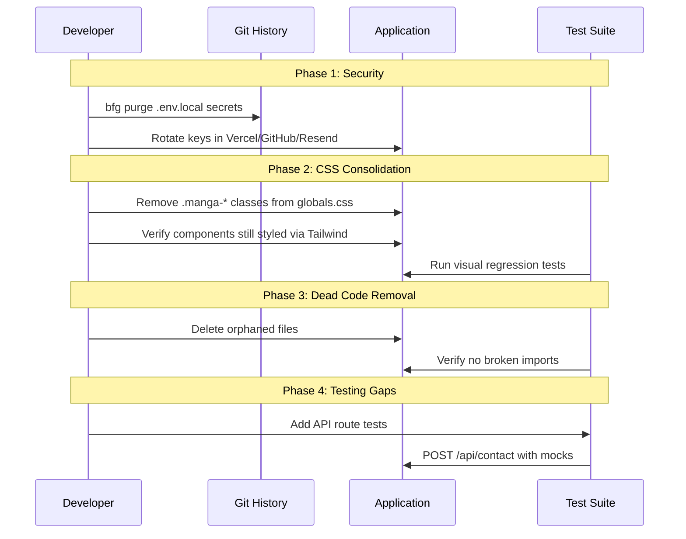
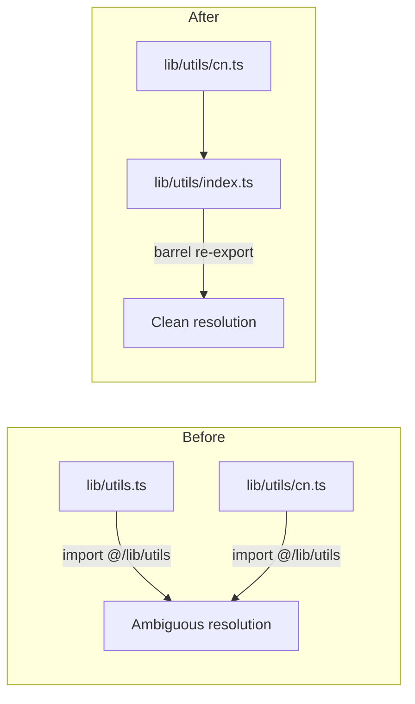

# Design Document: Codebase Remediation

## Overview

This document describes the technical approach for remediating 13 categories of issues in the manga-portfolio codebase. Each issue is addressed independently to minimize cross-cutting risk, with a strong emphasis on **preservation properties** — no user-visible changes are permitted.

The strategy follows three principles:
1. **Small, reversible changes** — each fix is independently verifiable
2. **CSS to Tailwind migration** — move styling from `globals.css` component classes into the React components that own them
3. **Test-first for new coverage** — write contact API tests before touching the route handler

## Key Technologies

- **Runtime**: Next.js 16.2.1 (App Router), React 19
- **Animation**: Framer Motion 12 (retain), GSAP 14 (remove)
- **Styling**: Tailwind CSS v4 with CSS-based `@theme` configuration (retain); `tailwind.config.ts` (remove/empty)
- **Email**: Resend (retain)
- **Testing**: Jest 30 + React Testing Library + fast-check (unit/property); Playwright (e2e)
- **CI**: GitHub Actions with Docker, Trivy, Syft, Cosign

## Design Principles

1. **Preservation-first**: Every change must be validated by the existing test suite. No visual or behavioral regressions.
2. **Single source of truth**: One definition per concept — CSS in one place, config in one place, utility exports in one place.
3. **Granular decomposition**: Files exceeding 200 lines of business logic should be split into focused modules.
4. **Explicit over implicit**: All `useEffect` dependencies must be listed. No `eslint-disable react-hooks/exhaustive-deps`.
5. **Test the boundaries**: Untested code paths (API routes, edge cases) get coverage before modification.

## Architecture Changes

### High-Level Architecture (Unchanged)

No architectural restructuring. All changes are localized refactors within existing files or new adjacent files.



### Component Interaction Flow for Key Changes



## Components and Interfaces

### R1: Credential Rotation

**Files changed:**
- `.env.local` — replace live values with placeholder templates
- `.gitignore` — verify `.env*.local` is listed
- `app/api/contact/route.ts` — tighten env var validation

**New behavior in `app/api/contact/route.ts`:**

```typescript
// BEFORE: silent fallback
const RESEND_API_KEY = process.env.RESEND_API_KEY || '';
const FROM_EMAIL = process.env.RESEND_FROM || 'onboarding@resend.dev';

// AFTER: explicit required env vars
function getRequiredEnvVar(name: string): string {
  const value = process.env[name];
  if (!value) {
    throw new Error(`Missing required environment variable: ${name}`);
  }
  return value;
}
// Called inside the handler, not at module scope
```

### R2: Body Overflow Fix

**File changed:** `components/horizontal-scroll/HorizontalScrollContainer.tsx`

**Approach:** Replace the `useEffect` that mutates `document.body.style.overflow` with a CSS class toggled via a ref-based approach on the container itself, OR use a portal-scoped approach.

```typescript
// BEFORE
useEffect(() => {
  const previousOverflow = document.body.style.overflow;
  document.body.style.overflow = "hidden";
  return () => { document.body.style.overflow = previousOverflow; };
}, []);

// AFTER: CSS class on <html> or dedicated approach
// Option A: Add/remove class on <html>
useEffect(() => {
  document.documentElement.classList.add('scroll-lock');
  return () => document.documentElement.classList.remove('scroll-lock');
}, []);

// In globals.css:
// .scroll-lock { overflow: hidden; }
```

### R3/R4: CSS Duplication & Tailwind Config Consolidation

**Files changed:**
- `styles/globals.css` — remove `@layer components` block (`.manga-panel`, `.speech-bubble`, `.manga-button`, etc.)
- `tailwind.config.ts` — remove all custom theme definitions, keep only minimal config or delete entirely
- Various `.tsx` component files — add Tailwind classes where they relied on CSS component classes

**Strategy:** Tailwind v4 with CSS-based `@theme` in `globals.css` is the source of truth. `tailwind.config.ts` will be emptied (only `content` paths remain if needed).

**Component class replacement mapping:**

| CSS Class | Replace with Tailwind in Component |
|-----------|-----------------------------------|
| `.manga-panel` | `border-[3px] border-manga-black bg-manga-white p-6 relative` |
| `.manga-panel-bordered` | `border-[3px] border-manga-black bg-manga-white p-6 relative shadow-manga` |
| `.speech-bubble` | `relative bg-manga-white border-[3px] border-manga-black rounded-2xl p-4` |
| `.manga-button` | Use `retroui/Button` component (already exists) |
| `.manga-button-outline` | Use `retroui/Button variant="outline"` (already exists) |
| `.manga-input` | Use `retroui/Input` component (already exists) |
| `.manga-textarea` | Use `retroui/Textarea` component (already exists) |
| `.chapter-header` | Use `manga/ChapterHeader` component (already exists) |
| `.stat-bar` / `.stat-bar-fill` | Inline in `SkillsPanel.tsx` |
| `.trading-card` | Inline in `InterestsPanel.tsx` |
| `.typewriter-text` | Inline in `SocialLinks.tsx` |
| `.halftone-overlay` | Use `manga/HalftonePattern` component (already exists) |
| `.speed-lines` | Inline or remove (component uses SVG) |

### R5: Dead Code Removal

**Files to delete:**
- `components/dashboard/ProfileChroma.tsx` (empty)
- `components/dashboard/ChromaGrid.css` (empty)
- `components/ChromaGrid.tsx` (unused, GSAP-dependent)
- `components/ChromaGrid.css` (unused, GSAP-dependent)
- `components/layout/PageTransition.tsx` (unused)
- `components/ui/.gitkeep` (no longer needed if dir is removed)
- `components/ui/` directory itself (only contains MangaImage — move up)
- `lib/utils.ts` (collides with `lib/utils/` directory)

**Files to move:**
- `components/ui/MangaImage.tsx` → `components/manga/MangaImage.tsx` (better fit)

**Naming collision fix:**
- Delete `lib/utils.ts`
- Create `lib/utils/index.ts` that re-exports everything from `cn.ts`, `validation.ts`, `colors.ts`

### R6: Animation Library Consolidation

**Strategy:** Remove GSAP since Framer Motion is used by 95% of the codebase.

- `ChromaGrid.tsx` is the only consumer of GSAP → it's being deleted (dead code, R5)
- Remove `gsap` from `package.json` dependencies
- Run `npm prune` to clean up

### R7: Contact API Tests

**New file:** `app/api/contact/route.test.ts`

```typescript
// Structure
import { POST } from './route';
import { Resend } from 'resend';

jest.mock('resend');

describe('POST /api/contact', () => {
  // Test 1: valid submission → 200
  // Test 2: missing name → 400
  // Test 3: missing email → 400
  // Test 4: missing subject → 400
  // Test 5: missing message → 400
  // Test 6: empty body → 400
  // Test 7: invalid RESEND_FROM → 500
  // Test 8: invalid CONTACT_RECEIVER_EMAIL → 500
  // Test 9: Resend throws → 500
  // Test 10: RESEND_API_KEY not set → 500
});
```

### R8: SplashScreen Decomposition

**New file structure:**

```
components/manga/
├── SplashScreen.tsx              ← orchestrator, ~80 lines
├── splash/
│   ├── BrokenScreenOverlay.tsx   ← from SplashScreen.tsx lines 191-269
│   ├── InkWipe.tsx               ← from SplashScreen.tsx lines 281-329
│   ├── WipeSpeedLines.tsx        ← from SplashScreen.tsx lines 331-357
│   ├── SplashSpeedLines.tsx      ← from SplashScreen.tsx lines 363-395
│   ├── HalftoneOverlay.tsx       ← from SplashScreen.tsx lines 397-414
│   └── CornerAccents.tsx         ← from SplashScreen.tsx lines 425-480
```

Each subcomponent gets a corresponding test file:
- `BrokenScreenOverlay.test.tsx`
- `InkWipe.test.tsx`
- `CornerAccents.test.tsx`

### R9: API Rate Limiting

**New file:** `lib/rate-limit.ts`

```typescript
interface RateLimitEntry {
  count: number;
  resetAt: number;
}

const store = new Map<string, RateLimitEntry>();

export function checkRateLimit(ip: string, maxRequests: number, windowMs: number): boolean {
  const now = Date.now();
  const entry = store.get(ip);

  if (!entry || now > entry.resetAt) {
    store.set(ip, { count: 1, resetAt: now + windowMs });
    return true; // allowed
  }

  if (entry.count >= maxRequests) {
    return false; // blocked
  }

  entry.count++;
  return true; // allowed
}

// Optional: periodic cleanup to prevent memory leak
if (typeof setInterval !== 'undefined') {
  setInterval(() => {
    const now = Date.now();
    for (const [key, entry] of store) {
      if (now > entry.resetAt) store.delete(key);
    }
  }, 60_000);
}
```

**Used in** `app/api/contact/route.ts`:
```typescript
const ip = req.headers.get('x-forwarded-for') ?? 'unknown';
if (!checkRateLimit(ip, 5, 60_000)) {
  return NextResponse.json(
    { error: 'Too many requests. Please try again later.' },
    { status: 429 }
  );
}
```

### R10: HorizontalScrollContainer Effect Consolidation

**Approach:** 
- Merge the scroll-position-tracking effect (lines 117-164) with the initial-scroll-to-panel effect (lines 69-115) since they both operate on the same container ref
- Replace `useRef<Record<number, boolean>>` for `panelBottomStateRef` with a callback pattern from children
- Move the focus-management effect (lines 179-185) to a dedicated hook `usePanelFocus`
- The resize handler (lines 348-366) needs its closure fixed to use ref-based currentIndex instead of state-based

**Target:** Reduce from 9 `useEffect` hooks to 5-6 by merging related concerns.

### R11: Fix Invalid CSS Properties

**File changed:** `styles/globals.css`

```css
/* BEFORE (does nothing) */
.manga-input:focus {
  outline: none;
  ring: 2px;
  ring-color: var(--color-manga-black);
  border-color: var(--color-manga-black);
}

/* AFTER (working) */
.manga-input:focus {
  outline: 3px solid var(--color-manga-black);
  outline-offset: 2px;
  border-color: var(--color-manga-black);
}
```

Same fix for `.manga-textarea:focus`.

### R12: Resolve `lib/utils` Naming Collision



- Delete `lib/utils.ts`
- Create `lib/utils/index.ts`:
```typescript
export { cn } from './cn';
export { validateName, validateEmail, validateSubject, validateMessage, validateContactForm } from './validation';
export { getApprovedColor, isApprovedColor, findNonCompliantColors, rgbToHex, hexToRgb, luminance, contrastRatio } from './colors';
```

## Data Models

No data model changes. The only new data is the in-memory rate limit store (a `Map<string, { count: number; resetAt: number }>`).

## Correctness Properties

### Property 1: No Exposed Secrets in Git History

*For any* commit reachable from any branch or tag, the file `.env.local` SHALL NOT contain any valid API keys or tokens.

**Validates: Requirements 1.1, 1.2**

### Property 2: Body Overflow Always Restored

*For any* sequence of mounts and unmounts of `HorizontalScrollContainer`, after the component unmounts, `document.body.style.overflow` SHALL equal its value before the component first mounted.

**Validates: Requirements 2.1, 2.2, 2.3**

### Property 3: CSS Class Equivalence

*For any* component that previously relied on a CSS component class (e.g., `.manga-panel`), after remediation the rendered element SHALL have an identical set of computed styles (ignoring Tailwind utility class text content).

**Validates: Requirements 3.2, 3.3, 13.1**

### Property 4: Theme Value Resolution

*For any* custom theme token used in the codebase (`shadow-manga`, `font-heading`, `color-manga-black`, etc.), AFTER consolidation, the token SHALL resolve to the same CSS value as before.

**Validates: Requirements 4.2, 4.3**

### Property 5: Import Resolution Uniqueness

*For any* import statement `import { ... } from "@/lib/utils"`, the import SHALL resolve to exactly one module and SHALL provide all exported members that any consumer currently uses.

**Validates: Requirements 12.1, 12.2**

### Property 6: Contact API Correctness

*For any* POST request to `/api/contact`:
- If all required fields are present and valid, the response SHALL be `200 { ok: true }`
- If any required field is missing, the response SHALL be `400`
- If the Resend API key is missing or Resend throws, the response SHALL be `500`

**Validates: Requirements 7.1, 7.2, 7.3, 7.4, 7.5**

### Property 7: Rate Limit Enforcement

*For any* sequence of HTTP requests from the same IP address, the 6th request within a 60-second window SHALL receive a `429` status code.

**Validates: Requirements 9.1, 9.2**

### Property 8: Splash Screen Behavior Preservation

*For any* user visit, the splash screen SHALL play the exact same sequence of phases (`splash → shatter → wipe-in → wipe-out → done`) with the same timing and visual appearance.

**Validates: Requirements 8.2, 13.4**

### Property 9: Test Suite Preservation

*For any* existing test in the test suite, AFTER all remediation changes, the test SHALL pass without modification.

**Validates: Requirements 13.5**

## Error Handling

| Scenario | Response | User Feedback |
|----------|----------|---------------|
| Rate limited (6th request in 60s) | `429` | Sonner toast: "Too many requests. Please try again later." |
| Missing env var (RESEND_API_KEY) | `500` | Sonner toast: "Email service not configured. Please contact the site owner." |
| Missing env var (FROM/RECEIVER) | `500` | Same as above |
| Resend service error | `500` | Sonner toast with generic error message |

## Testing Strategy

### Unit Tests (New)
- `app/api/contact/route.test.ts` — 10 test cases covering valid/invalid/mocked scenarios
- `lib/rate-limit.test.ts` — rate limit acceptance, window reset, cleanup, concurrent safety

### Component Tests (New)
- `components/manga/splash/BrokenScreenOverlay.test.tsx` — renders SVG cracks, calls onComplete
- `components/manga/splash/InkWipe.test.tsx` — animates wipe-in/wipe-out phases
- `components/manga/splash/CornerAccents.test.tsx` — renders 4 corner paths

### Property-Based Tests (New)
- `lib/rate-limit.properties.test.ts` — "For any sequence of requests, rate limit resets after window expires"
- `app/api/contact/contact.properties.test.ts` — "For any valid input, response is 200; for any missing field, response is 400"

### Regression Tests (Verify Existing)
- Run full `npm test` suite before and after each phase
- Run `npm run lint` and `npm run typecheck` to verify no type/introspection breaks
- Run `npx playwright test` for e2e smoke tests

### Property-Based Testing Applicability

**Assessment:** APPLICABLE (limited scope)

**Rationale:** Rate limiting has clear mathematical properties (threshold behavior, window resets) that benefit from PBT. The contact API has a defined input/output contract with discrete states (valid/missing fields/server error). These are good PBT candidates. The CSS and structural changes do not benefit from PBT since they involve visual equivalence rather than functional properties.

## Implementation Order

The work is organized into **7 phases** to minimize risk:

1. **Security** (R1) — Rotate credentials first to stop the bleeding
2. **Structural Cleanup** (R5, R12) — Remove dead code, fix naming collision
3. **CSS Consolidation** (R3, R4, R11) — Move styles, fix invalid properties
4. **Animation Consolidation** (R6) — Remove GSAP
5. **Splash Decomposition** (R8) — Extract subcomponents
6. **Bug Fixes** (R2, R10) — Fix overflow trap, consolidate effects
7. **Testing + Rate Limiting** (R7, R9) — New tests and API protection

Each phase has a checkpoint: run the full test suite, lint, typecheck, and manual visual verification of affected pages.
