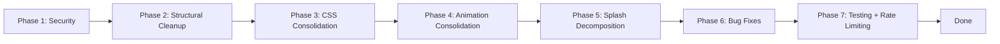

# Implementation Plan: Codebase Remediation

## Overview

Seven implementation phases executed sequentially. Each phase has a checkpoint: run the full test suite, lint, typecheck, and visually verify affected pages. No phase proceeds if the checkpoint fails. Total estimated effort: **medium** (2-3 focused sessions).



---

## Phase 1 — Security (R1)

**Goal:** Rotate exposed credentials and purge them from git history.

- [ ] **1.1 Rotate all exposed credentials**
  - Go to Resend dashboard → generate new API key
  - Go to Vercel dashboard → generate new OIDC token
  - Go to GitHub → generate new PAT or rotate the existing one
  - Verify all three services still work with new keys

- [ ] **1.2 Purge `.env.local` from git history**
  - Install `bfg` (BFG Repo-Cleaner) or use `git filter-branch`
  - Run: `bfg --delete-files .env.local`
  - Run: `git reflog expire --expire=now --all && git gc --prune=now --aggressive`
  - Verify: `git log --all --diff-filter=A -- .env.local` returns nothing
  - Force-push to remote (coordinate with any collaborators first)

- [ ] **1.3 Update `.env.local` with placeholder templates**
  ```env
  # Copy this file to .env.local and fill in your values
  RESEND_API_KEY=your_resend_api_key_here
  RESEND_FROM=your_verified_sender@example.com
  CONTACT_RECEIVER_EMAIL=you@example.com
  ```

- [ ] **1.4 Harden env var validation in `app/api/contact/route.ts`**
  - Replace module-level fallback constants with a `getRequiredEnvVar()` helper called inside the handler
  - Ensure missing env vars produce a clear 500 error, not a silent fallback to `onboarding@resend.dev`

- [ ] **1.5 Verify `.gitignore` coverage**
  - Ensure `.env*.local` is listed
  - Ensure `.env` is listed (if not used, add for safety)

- [x] **1.6 Checkpoint**
  - `npm run lint` passes
  - `npm run typecheck` passes (if one exists — verify with `npx tsc --noEmit`)
  - `npm test` passes
  - Contact API returns clear error when env vars are missing
  - No credentials remain in any git object

_Requirements: 1.1, 1.2, 1.3, 1.4_

---

## Phase 2 — Structural Cleanup (R5, R12)

**Goal:** Remove dead code, resolve naming collision.

- [ ] **2.1 Delete empty zombie files**
  - `components/dashboard/ProfileChroma.tsx`
  - `components/dashboard/ChromaGrid.css`

- [ ] **2.2 Delete unused GSAP-dependent files**
  - `components/ChromaGrid.tsx`
  - `components/ChromaGrid.css`

- [ ] **2.3 Delete unused component**
  - `components/layout/PageTransition.tsx`
  - Search for any remaining imports of `PageTransition` — if none, safe to delete

- [ ] **2.4 Move `MangaImage` and remove `components/ui/`**
  - Move `components/ui/MangaImage.tsx` → `components/manga/MangaImage.tsx`
  - Update all imports referencing `@/components/ui/MangaImage`
  - Delete the now-empty `components/ui/` directory
  - Delete `components/ui/.gitkeep`

- [ ] **2.5 Resolve `lib/utils` naming collision**
  - Delete `lib/utils.ts`
  - Create `lib/utils/index.ts` with barrel exports:
    ```typescript
    export { cn } from './cn';
    export {
      validateName,
      validateEmail,
      validateSubject,
      validateMessage,
      validateContactForm,
    } from './validation';
    export {
      getApprovedColor,
      isApprovedColor,
      findNonCompliantColors,
      rgbToHex,
      hexToRgb,
      luminance,
      contrastRatio,
    } from './colors';
    ```
  - Update all imports from `@/lib/utils` to work with the barrel (most should already match)
  - Delete `lib/utils.ts` (the root file, not the directory)

- [x] **2.6 Checkpoint**
  - `npm test` passes (confirm no broken imports)
  - `npx tsc --noEmit` passes (no missing module errors)
  - `npm run build` passes (no missing file errors)
  - `npm run lint` passes

_Requirements: 5.1, 5.2, 5.3, 5.4, 5.5, 12.1, 12.2_

---

## Phase 3 — CSS Consolidation (R3, R4, R11)

**Goal:** Remove duplicated CSS, consolidate Tailwind config, fix invalid properties.

- [ ] **3.1 Fix invalid `ring:` CSS properties in `globals.css`**
  - In `.manga-input:focus` and `.manga-textarea:focus`:
    ```css
    /* BEFORE */
    ring: 2px;
    ring-color: var(--color-manga-black);

    /* AFTER */
    outline: 3px solid var(--color-manga-black);
    outline-offset: 2px;
    ```

- [ ] **3.2 Remove `@layer components` block from `globals.css`**
  - Remove the entire `@layer components { ... }` section (lines 216–496)
  - This removes: `.manga-panel`, `.manga-panel-bordered`, `.speech-bubble`, `.speech-bubble::after`, `.halftone-overlay`, `.manga-button`, `.manga-button-outline`, `.typewriter-text`, `.manga-input`, `.manga-textarea`, `.chapter-header`, `.stat-bar`, `.stat-bar-fill`, `.trading-card`, `.speed-lines`

- [ ] **3.3 Ensure all components using removed CSS classes have Tailwind equivalents**
  - Verify `MangaPanel.tsx`: uses `border-[3px] border-manga-black bg-manga-white p-6 relative` etc. via its `variant` prop
  - Verify `SpeechBubble.tsx`: uses Tailwind classes directly; its SVG tail handles the `::after` pseudo-element
  - Verify `retroui/Button.tsx` handles both `.manga-button` and `.manga-button-outline` use cases via CVA variants
  - Verify `retroui/Input.tsx` and `retroui/Textarea.tsx` handle form field styling
  - Verify `SkillsPanel.tsx` has inline Tailwind for stat bars
  - Verify `InterestsPanel.tsx` has inline Tailwind for trading cards
  - Verify `SocialLinks.tsx` has inline Tailwind for typewriter text
  - Verify `components/manga/ChapterHeader.tsx` handles its own decorative lines
  - Add any missing Tailwind classes to these components. **No component should lose visual styling.**

- [ ] **3.4 Consolidate Tailwind configuration to CSS-based**
  - Open `tailwind.config.ts`
  - Remove all content from the `theme.extend` block
  - Leave only the `content` array and an empty `theme`:
    ```typescript
    import type { Config } from "tailwindcss";
    const config: Config = {
      content: [
        "./app/**/*.{js,ts,jsx,tsx}",
        "./components/**/*.{js,ts,jsx,tsx}",
        "./lib/**/*.{js,ts,jsx,tsx}",
      ],
    };
    export default config;
    ```
  - Verify that `globals.css` `@theme` block already defines all needed tokens
  - Run the build to confirm no Tailwind resolution errors

- [x] **3.5 Checkpoint**
  - `npm run build` passes (Tailwind resolves all classes)
  - `npm test` passes
  - Visual check of every route: panels, speech bubbles, buttons, inputs, stat bars, trading cards, chapter headers all look identical to before
  - Focus ring appears on `.manga-input` and `.manga-textarea` when tabbed to

_Requirements: 3.1, 3.2, 3.3, 3.4, 4.1, 4.2, 4.3, 4.4, 11.1, 11.2, 13.1, 13.5_

---

## Phase 4 — Animation Consolidation (R6)

**Goal:** Remove GSAP dependency.

- [ ] **4.1 Remove GSAP from package.json**
  - `npm uninstall gsap`
  - Verify no remaining imports of `gsap` anywhere in the codebase

- [ ] **4.2 Clean up lockfile**
  - `npm install` to update `package-lock.json`
  - `npm prune` to remove orphaned sub-dependencies

- [x] **4.3 Checkpoint**
  - `npm test` passes
  - `npm run build` passes
  - `npm ls gsap` returns "empty" (no gsap in tree)
  - All routes render without console errors

_Requirements: 6.1, 6.2, 6.3_

---

## Phase 5 — Splash Decomposition (R8)

**Goal:** Split 480-line `SplashScreen.tsx` into focused files.

- [ ] **5.1 Create `components/manga/splash/` directory**

- [ ] **5.2 Extract `BrokenScreenOverlay.tsx`**
  - Move the `BrokenScreenOverlay` component (SplashScreen.tsx lines 191–269)
  - Move constants: `RADIAL_CRACKS`, `BRANCH_CRACKS`, `SHARDS`
  - Export as named export

- [ ] **5.3 Extract `InkWipe.tsx`**
  - Move the `InkWipe` component (SplashScreen.tsx lines 281–329)
  - Move the `WipeSpeedLines` sub-component (lines 331–357)
  - Export both

- [ ] **5.4 Extract `SplashSpeedLines.tsx`**
  - Move the `SpeedLines` component used in the splash (SplashScreen.tsx lines 363–395)

- [ ] **5.5 Extract `SplashHalftoneOverlay.tsx`**
  - Move the `HalftoneOverlay` component (SplashScreen.tsx lines 397–414)

- [ ] **5.6 Extract `CornerAccents.tsx`**
  - Move the `CornerAccents` component (SplashScreen.tsx lines 425–480)

- [ ] **5.7 Refactor `SplashScreen.tsx` to orchestrator**
  - Import all subcomponents from `./splash/`
  - Keep only: state machine logic (`phase`, `dismiss`), keyboard handler, and the render tree
  - Target: ~80-100 lines

- [ ] **5.8 Write tests for extracted components**
  - `components/manga/splash/BrokenScreenOverlay.test.tsx`
    - Renders SVG with cracks and shards
    - Calls `onComplete` callback after animation duration
  - `components/manga/splash/InkWipe.test.tsx`
    - Renders in wipe-in phase
    - Renders in wipe-out phase
    - Calls appropriate callbacks
  - `components/manga/splash/CornerAccents.test.tsx`
    - Renders 4 SVG paths (one per corner)
    - Animates in with stagger delay

- [x] **5.9 Checkpoint**
  - `npm test` passes
  - Splash screen plays the identical sequence: splash → shatter → wipe-in → wipe-out → done
  - `npm run lint` passes
  - `npx tsc --noEmit` passes

_Requirements: 8.1, 8.2, 8.3_

---

## Phase 6 — Bug Fixes (R2, R10)

**Goal:** Fix body overflow trap, consolidate useEffect hooks.

- [ ] **6.1 Fix body overflow trap**
  - In `HorizontalScrollContainer.tsx`, replace the `useEffect` that mutates `document.body.style.overflow`:
    ```typescript
    // BEFORE
    useEffect(() => {
      const previousOverflow = document.body.style.overflow;
      document.body.style.overflow = "hidden";
      return () => { document.body.style.overflow = previousOverflow; };
    }, []);

    // AFTER
    useEffect(() => {
      document.documentElement.classList.add('scroll-lock');
      return () => document.documentElement.classList.remove('scroll-lock');
    }, []);
    ```
  - Add to `globals.css`:
    ```css
    html.scroll-lock {
      overflow: hidden;
    }
    ```

- [ ] **6.2 Merge scroll-position and scroll-init effects**
  - The scroll handler registration (lines 69–115) and the scroll-position tracking (lines 117–164) both depend on `containerNode` and `hydrated`
  - Merge into a single `useEffect` with both responsibilities
  - The merged effect:
    - Registers the scroll handler
    - Scrolls to panel 0 on init
    - Attaches the scroll event listener for position tracking
    - Returns a cleanup function that does both: deregisters handler + removes scroll listener + cancels RAF

- [ ] **6.3 Fix resize handler stale closure**
  - Change `scrollToPanel(currentIndex, false)` inside the resize timeout to use a ref:
    ```typescript
    const currentIndexRef = useRef(currentIndex);
    useEffect(() => { currentIndexRef.current = currentIndex; }, [currentIndex]);
    ```
  - The resize handler reads `currentIndexRef.current` inside the timeout, not `currentIndex` from the closure

- [ ] **6.4 Move focus management to a dedicated hook**
  - Extract the focus-management effect (lines 179–185) to:
    ```typescript
    // lib/hooks/usePanelFocus.ts
    export function usePanelFocus(panels: PanelConfig[], currentIndex: number) {
      useEffect(() => {
        const activePanel = document.getElementById(panels[currentIndex]?.id ?? '');
        const heading = activePanel?.querySelector<HTMLElement>('[data-panel-heading="true"]');
        heading?.focus({ preventScroll: true });
      }, [currentIndex, panels]);
    }
    ```
  - Import and use in `HorizontalScrollContainer.tsx`

- [ ] **6.5 Remove all `eslint-disable react-hooks/exhaustive-deps` comments**
  - Search the codebase for `eslint-disable-next-line react-hooks/exhaustive-deps`
  - Resolve each: add missing deps or restructure to avoid the need for suppression
  - Target: zero suppressions

- [x] **6.6 Checkpoint**
  - `npm test` passes
  - `npm run lint` passes (no exhaustive-deps warnings)
  - `npx playwright test` passes (horizontal scroll navigation works)
  - Manually verify: navigate to a non-panel route, scroll works normally
  - Manually verify: navigate back to panel route, horizontal scroll works
  - Resize browser window during horizontal scroll — no errors in console

_Requirements: 2.1, 2.2, 2.3, 2.4, 10.1, 10.2, 10.3, 10.4_

---

## Phase 7 — Testing + Rate Limiting (R7, R9)

**Goal:** Add contact API tests, implement rate limiting.

- [ ] **7.1 Create `app/api/contact/route.test.ts`**
  - Mock `Resend` from `resend` package
  - Mock `process.env` for `RESEND_API_KEY`, `RESEND_FROM`, `CONTACT_RECEIVER_EMAIL`
  - Test cases:
    1. Valid submission → 200 `{ ok: true }`
    2. Missing name → 400
    3. Missing email → 400
    4. Missing subject → 400
    5. Missing message → 400
    6. Empty JSON body → 400
    7. `RESEND_FROM` invalid → 500
    8. `CONTACT_RECEIVER_EMAIL` invalid → 500
    9. Resend throws `new Error('API error')` → 500 with error message
    10. `RESEND_API_KEY` not set → 500

- [ ] **7.2 Create `lib/rate-limit.ts`**
  ```typescript
  const store = new Map<string, { count: number; resetAt: number }>();

  export function checkRateLimit(
    ip: string,
    maxRequests: number = 5,
    windowMs: number = 60_000
  ): boolean {
    const now = Date.now();
    const entry = store.get(ip);

    if (!entry || now > entry.resetAt) {
      store.set(ip, { count: 1, resetAt: now + windowMs });
      return true;
    }

    if (entry.count >= maxRequests) return false;

    entry.count++;
    return true;
  }

  // Periodic cleanup to prevent memory leak
  export function startRateLimitCleanup(intervalMs: number = 60_000): () => void {
    const interval = setInterval(() => {
      const now = Date.now();
      for (const [key, entry] of store) {
        if (now > entry.resetAt) store.delete(key);
      }
    }, intervalMs);
    return () => clearInterval(interval);
  }
  ```

- [ ] **7.3 Integrate rate limiting into contact API**
  - In `app/api/contact/route.ts`, at the top of the `POST` handler:
    ```typescript
    const ip = req.headers.get('x-forwarded-for')?.split(',')[0]?.trim()
      ?? req.headers.get('x-real-ip')
      ?? '127.0.0.1';

    if (!checkRateLimit(ip)) {
      return NextResponse.json(
        { error: 'Too many requests. Please try again later.' },
        { status: 429 }
      );
    }
    ```

- [ ] **7.4 Create `lib/rate-limit.test.ts`**
  - Test: allows first 5 requests from same IP
  - Test: blocks 6th request within window
  - Test: resets after window expires
  - Test: different IPs have independent counters
  - Test: cleanup function removes expired entries

- [ ] **7.5 Create `app/api/contact/contact.properties.test.ts` (property-based)**
  - Use `fast-check` to generate valid and invalid contact form payloads
  - Property: "For any valid payload (all fields present, valid email format), response is 200"
  - Property: "For any payload missing at least one field, response is 400"
  - Property: "For any payload with empty string values, response is 400"

- [x] **7.6 Checkpoint — FINAL VALIDATION**
  - `npm test` passes (all old + new tests)
  - `npm run test:coverage` — verify new files have >80% coverage
  - `npm run lint` passes
  - `npx tsc --noEmit` passes
  - `npm run build` passes
  - `npx playwright test` passes
  - Manual smoke test of contact form: submit → success toast
  - Manual test of rate limiting: submit contact form 6 times rapidly → 6th shows error toast
  - Manual check of all routes: no visual regressions
  - `git status` shows only intended changes

_Requirements: 7.1, 7.2, 7.3, 7.4, 7.5, 9.1, 9.2, 9.3, 9.4, 13.5_

---

## Verification Matrix

| Phase | Test Command | Visual Check | Build Check |
|-------|-------------|--------------|-------------|
| P1: Security | `npm test` | Contact form | `npm run build` |
| P2: Cleanup | `npm test`, `npx tsc --noEmit` | — | `npm run build` |
| P3: CSS | `npm test` | All routes | `npm run build` |
| P4: Animation | `npm test` | All routes | `npm run build` |
| P5: Splash | `npm test` | Splash sequence | `npm run build` |
| P6: Bug fixes | `npm test`, `npx playwright test` | Scroll behavior | `npm run build` |
| P7: Tests | `npm test`, `npm run test:coverage` | Contact form | `npm run build` |

## Notes

- Tasks marked with `[x]` are checkpoints, not executable tasks
- Phases are designed to be independent — you can stop after any phase and the app remains functional
- Phase 3 (CSS) carries the highest risk of visual regression. Run careful visual checks after it
- Phase 5 (Splash) is pure refactoring — no behavior change. If tests pass, it's correct
- Phase 6 (Bug fixes) modifies the most complex component. The Playwright e2e tests are the safety net here
- If any checkpoint fails, stop and fix before proceeding to the next phase
