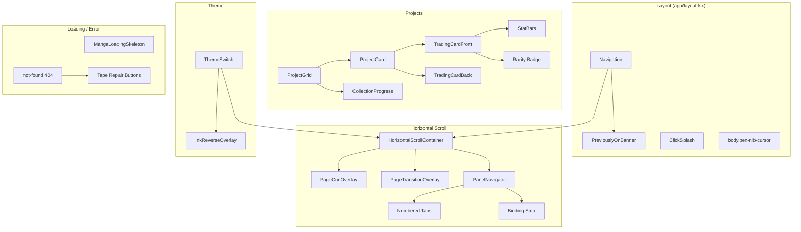

# Design Document: Manga Immersion Overhaul

## Overview

This design covers 8 coordinated UI/UX features that deepen the manga metaphor across the portfolio. Each feature extends existing components or adds new ones within the established Tailwind + Framer Motion + Next.js architecture. No backend changes are needed — all features are client-side, CSS/SVG-driven, and respect `prefers-reduced-motion`.

### Key Technologies

- **Frontend:** Next.js 16, React 19, TypeScript, Tailwind CSS v4, Framer Motion 12
- **Existing utilities reused:** `perspective-1000`, `preserve-3d`, `backface-hidden`, `stat-bar`, `stat-bar-fill`, `halftone-overlay`, `InkEffect`, `MangaPanel`, `ChapterHeader`, `shadow-manga` variants
- **Storage:** `localStorage` (Previously On...), `sessionStorage` (existing SplashScreen — unchanged)
- **No new npm dependencies**

### Design Principles

1. **Extend, don't replace** — Every feature builds on existing components and CSS utilities
2. **CSS/SVG-first animations** — Minimize JS runtime cost; use CSS transitions, SVG stroke-dasharray, Framer Motion only where interactivity requires it
3. **Accessibility-gated** — All animations respect `prefers-reduced-motion`; all interactive elements remain keyboard-accessible
4. **No layout shifts** — Cursor, loading states, and transitions must not cause content reflow
5. **Progressive enhancement** — Custom cursor falls back to OS default; loading states degrade to static outlines

---

## Architecture

### High-Level Component Relationship



### Communication/Data Flow

1. **Page-Curl:** `HorizontalScrollContainer` detects scroll/touch/keyboard → sets `isTransitioning` → `PageCurlOverlay` reads direction and renders shadow gradient → panel content peeks via negative margin
2. **Trading Cards:** `ProjectGrid` maps `Project` data → `ProjectCard` renders flip container → front face shows stats/rarity → hover triggers `rotateY(180)` via Framer Motion
3. **Panel Navigator:** `HorizontalScrollContainer` passes `currentIndex`/`totalPanels` to `PanelNavigator` → renders numbered tabs + binding strip + tankobon label
4. **Ink Reverse:** `ThemeSwitch` click → `InkReverseOverlay` mounts → white flash animation → at midpoint `setTheme()` fires → overlay dismounts
5. **Previously On...:** `PreviouslyOnBanner` mounts → reads `localStorage` → if `visitCount > 1`, renders banner → auto-dismisses after 5s → `Navigation`/`HorizontalScrollContainer` write to `localStorage` on navigation

---

## Components and Interfaces

### Feature 1: Page-Curl

#### `PageCurlOverlay.tsx` (New)

```
Props:
  direction: 'left' | 'right' | null   // null = no animation
  reducedMotion: boolean
  onComplete: () => void
```

- Renders fixed overlay with gradient shadow
- Shadow orientation flips based on `direction`
- Animates opacity: 0 → 1 (0.15s) → hold (0.25s) → 0 (0.15s)
- Total duration: 0.55s
- Reports completion via `onComplete`

#### Changes to `HorizontalScrollContainer.tsx`

- Add state: `pageCurlDirection: 'left' | 'right' | null`
- In `scrollToPanel`, determine direction from `(newIndex - currentIndex)` and set state
- Pass `direction` to `PageCurlOverlay` prop
- Add edge peek: render 60px of next panel using negative margin on current panel

### Feature 2: Trading Cards

#### `TradingCardFront.tsx` (New)

```
Props:
  project: Project & { rarity: Rarity; stats: Stats }
```

| Element | Implementation |
|---------|---------------|
| Thumbnail | `MangaImage` with `fill`, 3:2 aspect ratio |
| Title | `font-heading uppercase text-xl` |
| Rarity badge | ★ / ★★ / ★★★ with color tint (common=gray, rare=black, legendary=gold via class) |
| Card number | `#001` in top-left corner, `font-mono text-xs` |
| Stat bars | 3 x `stat-bar` with `stat-bar-fill` at `width: {stat}%` |
| Halftone | Subtle `halftone-overlay` at 0.15 opacity |

#### `TradingCardBack.tsx` (New)

```
Props:
  project: Project
```

- Back face: `backface-hidden rotateY(180deg)`
- Content: shortened description (2 lines), tech stack badges, "View Details →" CTA button

#### Changes to `ProjectCard.tsx`

- Wrap front/back in `perspective-1000 preserve-3d` container
- Inner wrapper: `motion.div` with `whileHover={{ rotateY: 180 }}`, `transition={{ duration: 0.5 }}`
- Front/back each get `absolute inset-0 backface-hidden`
- Preserve existing click → `router.push` and keyboard handlers

### Feature 3: Panel Navigator

#### Changes to `PanelNavigator.tsx`

Replace the dot loop with:

```typescript
{Array.from({ length: totalPanels }).map((_, index) => {
  const isActive = index === state.activeDot;
  return (
    <button
      key={index}
      onClick={() => scrollToPanel(index)}
      aria-label={`Go to panel ${index + 1}`}
      className={`
        h-8 w-8 border border-manga-black font-heading text-xs
        transition-all duration-150
        ${isActive
          ? 'bg-manga-black text-manga-white -translate-x-0.5 -translate-y-0.5 shadow-manga-sm'
          : 'bg-manga-white text-manga-black hover:bg-manga-gray-50'
        }
      `}
    >
      {index + 1}
    </button>
  );
})}
```

#### New utility in `utils.ts`

```typescript
export function getTankobonLabel(currentIndex: number, totalPanels: number): string {
  return `VOL. 1 — pp. ${currentIndex + 1} / ${totalPanels}`;
}
```

### Feature 4: Pen Nib Cursor

#### CSS (in `globals.css`)

```css
.pen-nib-cursor {
  cursor: url("data:image/svg+xml,%3Csvg xmlns='http://www.w3.org/2000/svg' width='24' height='24'%3E%3Cpath d='M2 22 L12 2 L22 22 L12 18 Z' fill='black' stroke='black' stroke-width='1'/%3E%3C/svg%3E") 0 24, auto;
}

.pen-nib-cursor a,
.pen-nib-cursor button,
.pen-nib-cursor [role="button"] {
  cursor: url("data:image/svg+xml,%3Csvg xmlns='http://www.w3.org/2000/svg' width='24' height='24'%3E%3Ccircle cx='12' cy='12' r='10' fill='none' stroke='black' stroke-width='2'/%3E%3Ctext x='12' y='15' text-anchor='middle' font-size='7' font-family='monospace' fill='black'%3EREAD%3C/text%3E%3C/svg%3E") 12 12, pointer;
}
```

#### `ClickSplash.tsx` (New)

- Global click listener attached in root layout via `useEffect`
- On click, create portal with `motion.div` at `(event.clientX - 10, event.clientY - 10)`
- Renders 20×20px SVG ink splash (reuse `InkEffect` splash path)
- Animate: scale 0 → 1.2 → 0, opacity 0 → 0.6 → 0, duration 0.4s
- Remove element after animation completes
- Skip if `prefers-reduced-motion`

### Feature 5: Ink Reverse Dark Mode

#### `InkReverseOverlay.tsx` (New)

- Fixed full-screen overlay at `z-[9999]`
- Two layers:
  1. White flash: `<motion.div className="bg-white" />` opacity 0→1→0 over 0.3s
  2. Ink splash: `<InkEffect variant="splash" />` at 0.15s, fades 0.2s

#### Changes to `ThemeSwitch.tsx`

- Replace "Dark" label text: when `isDark` → label shows `白`, when `!isDark` → label shows `墨`
- Add "Ink Reverse" as the toggle's accessible label
- On toggle: set state to show `InkReverseOverlay`, use `setTimeout(0.15s)` to fire `setTheme()`
- Overlay auto-dismounts after 0.5s

### Feature 6: Manga Loading States

#### `MangaLoadingSkeleton.tsx` (New)

```
Props:
  panels?: 1 | 2 | 3          (default 2)
  variant?: 'page' | 'card' | 'list'   (default 'page')
  className?: string
```

**Rendering by variant:**
- `page`: Full-width panel outlines, 2 panels stacked vertically
- `card`: 3 small panel outlines in a horizontal row (for grid)
- `list`: 1 panel with many content lines

**SVG structure for each panel outline:**
```svg
<rect
  x="2%" y="2%"
  width="96%" height="96%"
  rx="4"
  fill="none"
  stroke="currentColor"
  strokeWidth="3"
  strokeDasharray="1200"
  strokeDashoffset="1200"
  className="panel-border-draw"
/>
<!-- Content lines -->
<line x1="10%" y1="30%" x2="60%" y2="30%" stroke="currentColor" strokeWidth="2" strokeDasharray="400" strokeDashoffset="400" className="content-line-draw" style="animation-delay: 0.6s" />
<line x1="10%" y1="50%" x2="80%" y2="50%" stroke="currentColor" strokeWidth="2" strokeDasharray="400" strokeDashoffset="400" className="content-line-draw" style="animation-delay: 0.8s" />
<line x1="10%" y1="70%" x2="40%" y2="70%" stroke="currentColor" strokeWidth="2" strokeDasharray="400" strokeDashoffset="400" className="content-line-draw" style="animation-delay: 1.0s" />
```

**CSS keyframes** (in `globals.css`):
```css
@keyframes drawBorder {
  to { stroke-dashoffset: 0; }
}
@keyframes drawLine {
  to { stroke-dashoffset: 0; }
}
.panel-border-draw { animation: drawBorder 0.6s ease-out forwards; }
.content-line-draw { animation: drawLine 0.4s ease-out forwards; }
```

**`prefers-reduced-motion`**: Render same SVG but with `strokeDashoffset: 0` (static outlines, no animation).

### Feature 7: Previously On... Banner

#### `PreviouslyOnBanner.tsx` (New)

```
No props — reads/writes localStorage directly.
```

**localStorage schema:**
```typescript
interface MangaPortfolioHistory {
  lastSection: string;         // route path e.g. '/projects'
  lastSectionLabel: string;    // human-readable e.g. 'the Projects Archive'
  visitCount: number;
  lastVisit: string;           // ISO date
}
```

**Key:** `manga-portfolio-history`

**Flow:**
1. On mount, try `JSON.parse(localStorage.getItem('manga-portfolio-history'))`
2. If null or missing: initialize with `{ visitCount: 1, lastSection: '/', lastSectionLabel: 'the Home page' }`, render nothing
3. If `visitCount >= 1`: increment `visitCount`, show banner
4. Banner auto-dismisses after 5s (or on click)
5. On dismiss, update localStorage with incremented count

**Visual:**
- Absolute position below nav bar (`top-16 left-0 right-0 z-40`)
- `bg-manga-gray-50 border-b-manga border-manga-black`
- Flex layout: label | text | button
- Entrance: `animate-slideDown` (translateY -100% → 0, 0.3s)

#### Changes to `Navigation.tsx`

In `onNavClick`, after handling the navigation action, write to localStorage:

```typescript
try {
  const existing = JSON.parse(localStorage.getItem('manga-portfolio-history') || '{}');
  localStorage.setItem('manga-portfolio-history', JSON.stringify({
    ...existing,
    lastSection: href,
    lastSectionLabel: `the ${link.label} page`,
    lastVisit: new Date().toISOString(),
  }));
} catch { /* localStorage unavailable */ }
```

### Feature 8: Ripped Page 404

#### Changes to `app/not-found.tsx`

**Layout structure:**
```
┌─ Container (border-manga, shadow-manga, bg-manga-white) ─┐
│  ┌─ Content area (clipped) ──────────────────────────────┐ │
│  │  Confused face SVG (top-left, 120px)                  │ │
│  │                                                        │ │
│  │  THIS PAGE HAS BEEN RIPPED OUT... (h1, font-heading)  │ │
│  │  "The page you were looking for is missing..."         │ │
│  │                                                        │ │
│  │  [📄 Home] [📄 Projects] [📄 About] [📄 Contact]     │ │
│  │  (tape-repair buttons, rotated slightly)               │ │
│  └────────────────────────────────────────────────────────┘ │
│  ╱╲╱╲╱╲╱╲╱╲╱╲╱╲╱╲╱╲╱╲╱╲╱╲ (jagged torn edge)           │
└──────────────────────────────────────────────────────────────┘
```

**Torn edge implementation:**
```css
.clip-path-ripped {
  clip-path: polygon(
    0% 0%, 100% 0%, 100% 85%,
    95% 88%, 90% 84%, 85% 90%, 80% 85%,
    75% 89%, 70% 83%, 65% 88%, 60% 84%,
    55% 90%, 50% 85%, 45% 89%, 40% 83%,
    35% 88%, 30% 84%, 25% 90%, 20% 85%,
    15% 89%, 10% 84%, 5% 88%, 0% 85%
  );
}
```

**Tape repair button styling:**
```css
.tape-button {
  background: rgba(253, 230, 138, 0.7);   /* amber-200/70 */
  border: 1px solid rgba(180, 120, 50, 0.3);
  transform: rotate(-1deg);
  box-shadow: 0 1px 2px rgba(0,0,0,0.1);
  font-family: 'Courier New', monospace;
  font-size: 0.75rem;
  text-transform: uppercase;
  padding: 0.5rem 1rem;
}
/* Each button gets a slightly different rotation via nth-child */
.tape-button:nth-child(odd) { transform: rotate(1.5deg); }
.tape-button:nth-child(even) { transform: rotate(-1deg); }
```

---

## Data Models

### Extended `Project` Type

```typescript
// types/index.ts
export type Rarity = 'common' | 'rare' | 'legendary';

export interface ProjectStats {
  code: number;        // 0-100
  design: number;      // 0-100
  innovation: number;  // 0-100
}

export interface Project {
  // ... existing fields (id, title, description, slug, thumbnail, techStack, category) ...
  rarity?: Rarity;
  cardNumber?: number;
  stats?: ProjectStats;
}
```

### localStorage Schema

```typescript
// Used by PreviouslyOnBanner
interface MangaPortfolioHistory {
  lastSection: string;
  lastSectionLabel: string;
  visitCount: number;
  lastVisit: string;
}
```

---

## Correctness Properties

### Property 1: Page-curl Does Not Disrupt Navigation
*For any* navigation action (scroll, swipe, arrow key, click), the page-curl animation SHALL complete before the new panel is fully interactive.

**Validates: Requirements 1.1, 1.2, 1.3, 1.4**

### Property 2: Trading Card Flip Is Reversible
*For any* hover state on a trading card, the card SHALL return to its front face when the cursor leaves.

**Validates: Requirement 2.2**

### Property 3: Panel Navigator Always Shows Correct Index
*For any* `currentIndex` in `[0, totalPanels - 1]`, the navigator SHALL display the correct active tab and page label.

**Validates: Requirements 3.1, 3.2, 3.3**

### Property 4: Custom Cursor Never Blocks Interaction
*For any* interactive element (link, button, card), the custom cursor hotspot SHALL align with the element's clickable area.

**Validates: Requirements 4.1, 4.2**

### Property 5: Ink Reverse Toggle Preserves Theme State
*For any* toggle action, the dark mode state before and after the animation SHALL match the `next-themes` `resolvedTheme` value.

**Validates: Requirements 5.1, 5.4, 5.5**

### Property 6: Loading Skeleton Does Not Cause Layout Shift
*For any* loading state, the manga skeleton SHALL occupy exactly the same dimensions as the content it replaces.

**Validates: Requirements 6.1, 6.3**

### Property 7: "Previously On..." Persists Across Sessions
*For any* browser session, the `localStorage` data SHALL persist and be readable on the next session.

**Validates: Requirements 7.1, 7.4, 7.6**

### Property 8: 404 Page Shows Proper HTTP Status
*For any* invalid route, the server SHALL return HTTP 404 status alongside the custom page.

**Validates: Requirement 8.1**

### Property 9: Reduced Motion Disables All Animations
*For any* feature with animations, if `prefers-reduced-motion: reduce` is set, all moving elements SHALL render in their final/static state.

**Validates: Requirements 1.5, 4.4, 6.5**

### Property 10: Previously On... Does Not Show on First Visit
*For any* first-time visitor (`visitCount` === 0 or absent), the banner SHALL NOT render.

**Validates: Requirement 7.5**

---

## Error Handling

| Scenario | Behavior | User Feedback |
|----------|----------|---------------|
| Custom cursor SVG fails to load | CSS falls back to `auto` / `pointer` | Default OS cursor, no error |
| `localStorage` is unavailable (private browsing) | Wrap in try/catch; silently skip "Previously On..." | No banner, no console error |
| Trading card stat values missing (0 or undefined) | Stat bars render at 0% width | Empty bar — graceful degradation |
| Page-curl animation interrupted by rapid scrolling | Queue last navigation request; skip intermediate curls | Final panel renders correctly |
| SVG clip-path for ripped 404 not supported | Browser ignores clip-path; page renders as normal rectangle | Content still visible, just not jagged |

---

## Testing Strategy

### Unit Tests

| Test | Focus |
|------|-------|
| `getTankobonLabel` (utils) | Verify format for indices 0..n-1, edge cases (1 panel) |
| `TradingCardFront` | Verify stat bar widths at boundary values (0, 50, 100) |
| `TradingCardBack` | Verify back face is hidden by default (CSS class) |
| `PreviouslyOnBanner` | Verify localStorage read/write, visit count increment, first-visit suppression |
| `PanelNavigator` | Verify tab rendering for all panel counts (0, 1, 4, 10) |
| `MangaLoadingSkeleton` | Verify correct number of panels for each variant |
| `InkReverseOverlay` | Verify theme state matches `next-themes` value after toggle animation |

### Integration Tests

| Test | Focus |
|------|-------|
| `HorizontalScrollContainer` | Verify page-curl CSS class is applied/removed during transitions |
| `ThemeSwitch` | Verify `InkReverseOverlay` flash timing and theme state consistency |
| `not-found` | Verify HTTP 404 status and ripped-page SVG clip-path renders |
| `ProjectCard` | Verify flip animation triggers on hover, resets on mouseleave |

### E2E Tests (Playwright)

| Test | Steps |
|------|-------|
| Page-curl | Scroll through all 4 panels; verify curl shadow appears/disappears |
| Trading cards | Hover each card on projects page; verify flip animation completes |
| Previously On... | Visit page → navigate → close browser → reopen → verify banner appears |
| Ink Reverse | Toggle dark mode; verify label changes and flash overlay |
| 404 | Navigate to `/nonexistent`; verify ripped page layout and tape button navigates home |
| Reduced motion | Set `prefers-reduced-motion: reduce` via Playwright emulation; verify all animations render final state |
| Loading states | Navigate to slow-loading sections; verify manga panel outlines before content |

### Accessibility Tests

- Keyboard navigation of `PanelNavigator` tabs (Tab, Enter, Arrow keys)
- Focus management after page-curl transition
- Screen reader announcements for Previously On... banner
- Color contrast in Ink Reverse mode
- Verify all features pass axe-core scan

### Property-Based Testing Applicability

**Assessment:** APPLICABLE for specific features

**Rationale:**
- **Panel Navigator:** Property-based test can verify that for any `currentIndex` (0 to totalPanels-1), the active tab is correctly highlighted and the label format is valid.
- **Previously On...:** Property-based test can verify that for any sequence of navigation events, the `localStorage` data remain internally consistent (e.g., lastSection always matches the last navigated section, visitCount never decreases).
- **Trading card stats:** Property-based test can verify that for any stat value (0-100 inclusive), the visual width of the stat bar is proportional.
- **Page-curl:** Less suitable — timing/visual properties are hard to test formally without visual regression tools.
